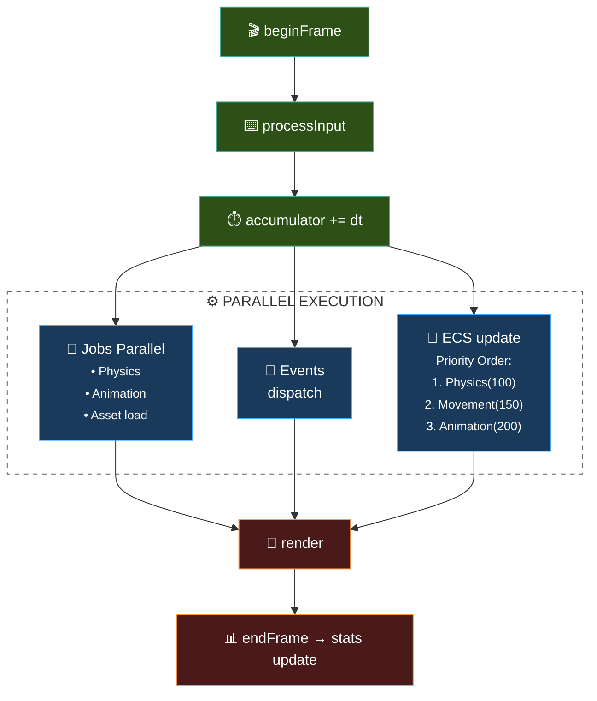
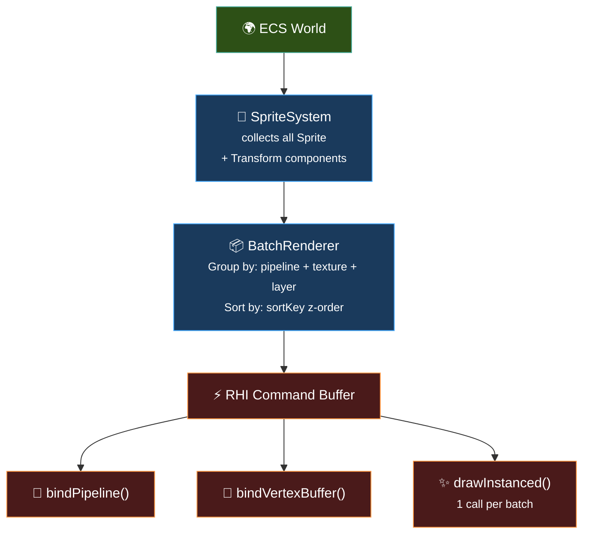
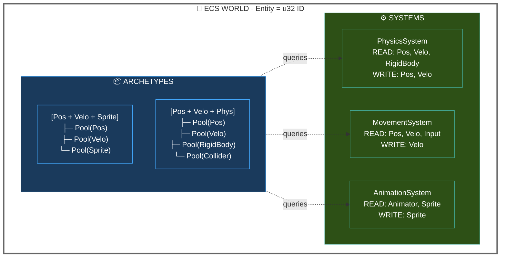
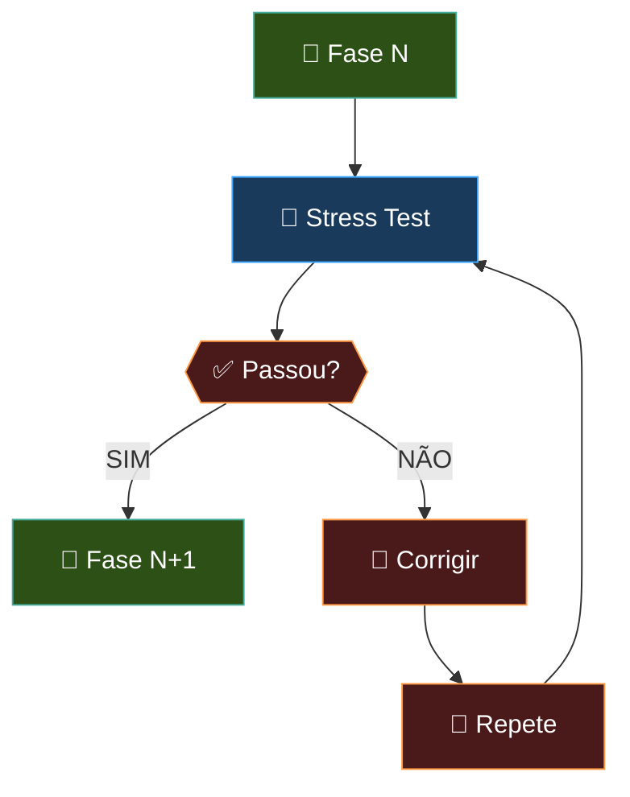

# 🗺️ Roadmap de Desenvolvimento

Visão executiva das 6 fases do projeto. Para **detalhes técnicos completos** de cada fase (arquitetura, arquivos, critérios de progresso), consulte [`docs/MASTER.md`](../docs/MASTER.md) §4 e [`architecture_specs.md`](architecture_specs.md) para APIs completas.

---

## 📊 Status Geral

```
Fase 0: Setup & Docs       █████████░░░░░░  70%  ← ATUAL
Fase 1: Fundação Atômica   ░░░░░░░░░░░░░░░  0%
Fase 2: Concorrência        ░░░░░░░░░░░░░░░  0%
Fase 3: RHI & 2D            ░░░░░░░░░░░░░░░  0%
Fase 4: ECS & Sistemas      ░░░░░░░░░░░░░░░  0%
Fase 5: Transição 3D          ░░░░░░░░░░░░░░░  0%
Fase 6: Caffeine Studio IDE  ░░░░░░░░░░░░░░░  0%
```

---

## 🔧 Fase 0: Setup Inicial & Documentação

**Responsável:** Guilda Codex  
**Status:** 🕒 Em Progresso

| Tarefa | Status |
|---|:---:|
| README.md criado | ✅ |
| Manifesto de desenvolvimento criado | ✅ |
| Roadmap de 6 fases documentado | ✅ |
| Fluxo R.I.C.O. estabelecido | ✅ |
| `docs/MASTER.md` criado | ✅ |
| `architecture_specs.md` criado | ✅ |
| `memory_model.md` criado | ✅ |
| Estrutura de diretórios `/src` planejada | 🔄 |
| `.gitignore` verificado | ⏳ |
| CMakeLists.txt base criado | ⏳ |
| `Caffeine.h` com tipos básicos criado | ⏳ |

### Próximos Marcos
1. Criar `/src/core/Types.hpp` com tipos (`u32`, `f64`, etc.)
2. Criar `CMakeLists.txt` base
3. Criar `.gitignore` completo

---

## 🧱 Fase 1: Fundação Atômica

**Responsável:** Architects  
**Status:** 📅 Planejado

> Criar independência total da `std` e garantir controle absoluto do hardware.

### Entregáveis

```
src/
├── Caffeine.hpp                  # Header principal de inclusão
├── core/
│   ├── Types.hpp              # u32, f64, etc. + static_assert
│   ├── Platform.hpp           # Macros de plataforma
│   ├── Assertions.hpp         # CF_ASSERT, CF_UNREACHABLE
│   └── Compiler.hpp          # Macros de compilador
├── memory/
│   ├── Allocator.hpp         # Interface base IAllocator
│   ├── LinearAllocator.hpp   # O(1), reset()
│   ├── PoolAllocator.hpp     # Slots fixos, O(1) amortizado
│   └── StackAllocator.hpp     # Marcadores, O(1)
├── containers/
│   ├── Vector.hpp            # Array dinâmico cache-friendly
│   ├── HashMap.hpp          # Tabela hash O(1)
│   ├── StringView.hpp        # String sem ownership
│   └── FixedString.hpp       # Buffer inline, zero heap
└── math/
    ├── Vec2.hpp, Vec3.hpp, Vec4.hpp
    ├── Mat4.hpp              # Matriz 4×4 column-major
    └── Math.hpp             # Utility functions
```

### Critério de Progresso
**Stress test:** 1M allocs → zero memory leaks, fragmentação < 0.1%.

---

## ⚡ Fase 2: O Pulso e a Concorrência

**Responsável:** Architects  
**Status:** 📅 Planejado

> Utilizar todos os núcleos da CPU e manter clock estável. Primeira camada de input e ferramentas de debug.

### Entregáveis

| Componente | Descrição | Arquivos |
|---|---|---|
| **High-Resolution Timer** | Precisão de microssegundos, `TimePoint`, `Duration` | `time/Timer.hpp` |
| **Job System** | Thread pool com workers, fila lock-free, `JobHandle` | `threading/JobSystem.hpp` |
| **Game Loop** | Fixed timestep + interpolation, state machine | `core/GameLoop.hpp` |
| **Input System** | Action mapping, polling/event-driven, gamepad | `input/InputManager.hpp` |
| **Debug Tools** | Logging, profiler, debug draw | `debug/LogSystem.hpp` |

### Ciclo de Game Loop



### Critério de Progresso
**Physics demo:** 10K partículas, todos os núcleos a 80%+ carga, `tsan` clean.

---

## 👁️ Fase 3: O Olho da Engine

**Responsável:** Artisans / Architects  
**Status:** 📅 Planejado

> Construir a camada de renderização agnóstica e sistema de assets.

### Entregáveis

| Componente | Descrição | Dependência |
|---|---|---|
| **RHI** | Abstração sobre SDL_GPU, `DrawCommand` queue | Core |
| **Batch Renderer** | 50K sprites → 1 draw call | RHI |
| **Camera System** | Matriz 4×4, ortográfica (2D) / perspectiva (3D) | Math |
| **Asset Manager** | Async loading, cache, hot-reload | Job System |
| **Texture Atlas** | Bin-packing, UV coordinates | Asset Manager |

### Pipeline de Renderização



### Critério de Progresso
**Demo:** 50K sprites na tela a **60fps estável**.

---

## 🧠 Fase 4: O Cérebro

**Responsável:** Architects  
**Status:** 📅 Planejado

> ECS completo, sistemas de gameplay, comunicação desacoplada.

### Entregáveis

| Componente | Descrição | Dependência |
|---|---|---|
| **ECS Core** | Archetype-based, queries, systems | Core, Memory |
| **Scene Manager** | Hierarquia, transições, `.caf` serialization | ECS, Asset Manager |
| **Event Bus** | Pub/sub typed, fila com prioridade | ECS |
| **Audio System** | SDL3 audio, pooling, spatial 2D | Asset Manager |
| **Animation System** | Sprite frames, state machine | ECS, Asset Manager |
| **Physics (2D)** | AABB/circle collision, layers | ECS, Math |
| **UI System** | Retained mode, ECS integration | ECS, Render |

### Arquitetura ECS



### Componentes ECS Pré-definidos

```cpp
// Transform
Position2D, Velocity2D, Rotation2D, WorldTransform, Parent

// Visual
Sprite, Animator, Camera2D

// Physics
RigidBody2D, Collider2D

// Audio
AudioEmitter, AudioRequest

// Tags
Player, Enemy, Projectile, Particle, Disabled, Destroy

// Meta
Name, SceneRef
```

### Critério de Progresso
**Demo:** 100 entidades dinâmicas, 5+ sistemas rodando, serialização end-to-end.

---

## 🌐 Fase 5: Transição Dimensional

**Responsável:** Artisans  
**Status:** 📅 Planejado

> Expansão para 3D sem quebrar o 2D existente.

### Entregáveis

| Componente | Descrição | Dependência |
|---|---|---|
| **3D Math Extension** | Quaternions, matrizes 3D, SIMD hints | Math |
| **Mesh Loading** | `.obj`, `.gltf`, shaders HLSL/GLSL | Asset Manager, RHI |
| **Spatial Partitioning** | Quadtree → Octree, frustum culling | Physics |
| **Camera3D** | Projeção perspectiva, lookAt | Math, Camera |
| **Skeletal Animation** | Bones, skinning, blend trees | Animation |

### Critério de Progresso
**Demo:** Mesh 3D carregada, shader customizado, **60fps**.

---

## 🏛️ Fase 6: O Olimpo

**Responsável:** Full Guild  
**Status:** 📅 Planejado

> Transformar a engine em ferramenta visual para a comunidade.

### Entregáveis

| Componente | Descrição |
|---|---|
| **Embedded UI** | Dear ImGui, profiler, console, cvar system |
| **Scene Editor** | Drag-and-drop, inspector, hierarchy, gizmos |
| **Asset Pipeline** | Processador de textures/áudio → `.caf` bundles |
| **Scripting (TBD)** | Possível integração com Lua/AngelScript |

### Critério de Progresso
**Primeiro game completo** feito 100% na Caffeine.

---

## 🚦 Gates Entre Fases

**Regra:** Não avançamos para a Fase N+1 enquanto a Fase N não passar no Stress Test.



### Stress Tests por Fase

| Fase | Teste | Benchmark |
|---|---|---|
| **1** | 1M allocs, 0 leaks | <0.1% fragmentação |
| **2** | 10K partículas, tsan/asan clean | 80%+ CPU em 8 cores |
| **3** | 50K sprites | 60fps, 1 draw call |
| **4** | 100 entidades, 5 sistemas | save/load round-trip <200ms |
| **5** | Mesh 3D, shader | 60fps, hot-reload |
| **6** | Game completo | Fim ao fim sem crash |

---

## 📈 Evolução de Versão

| Fase | Versão | Significado |
|---|---|---|
| 0 | `0.0.x` | Pré-alpha, documentação |
| 1-2 | `0.1.x` | Alpha, engine base usável para protótipos |
| 3-4 | `0.3.x` | Beta, games 2D funcionais possíveis |
| 5 | `0.5.x` → `1.0.0` | Feature-complete, API congelando |
| 6 | `1.0.0+` | Stable, primeiro game profissional |

---

## 🔗 Referências de Arquitetura

Baseado em pesquisa de:

- [flecs](https://github.com/SanderMertens/flecs) — ECS archetype-based com cache locality
- [EnTT](https://github.com/skypjack/entt) — ECS patterns e integração com game loops
- [Jolt Physics](https://github.com/jrouwe/JoltPhysics) — Job System com barreiras
- [Box2D/LiquidFun](https://github.com/google/liquidfun) — Física 2D com broad/narrow phase
- [Handmade Hero](https://github.com/cmuratori/HandmadeHeroCode) — Padrões de engine de baixo nível
- [Fixed Timestep Demo](https://github.com/jakubtomsu/fixed-timestep-demo) — Padrão accumulator

---

> *"Grandes jogos são construídos com código forte e muito café."*
