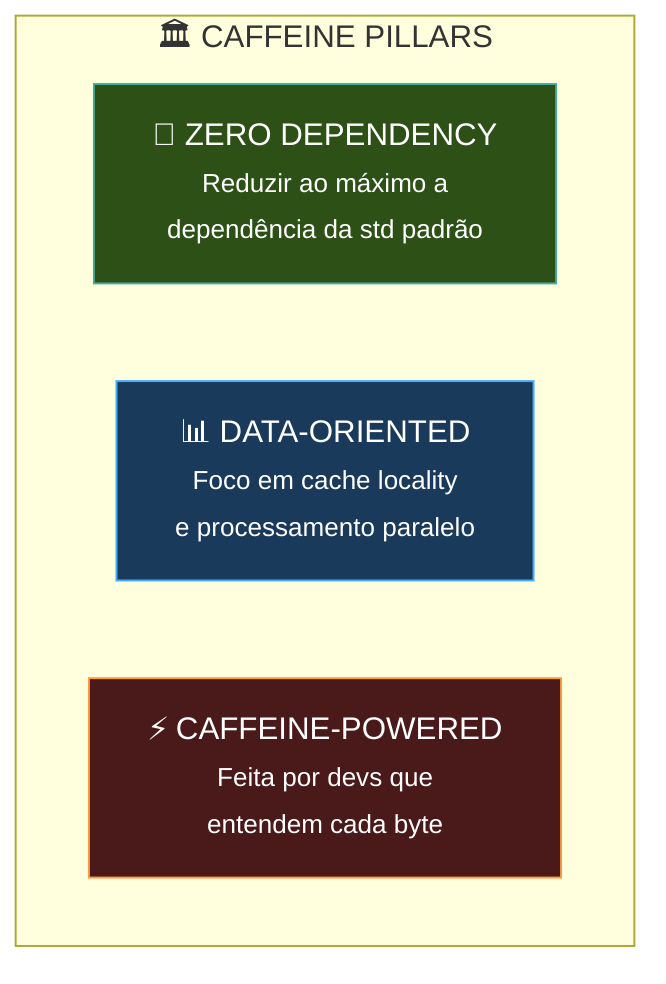
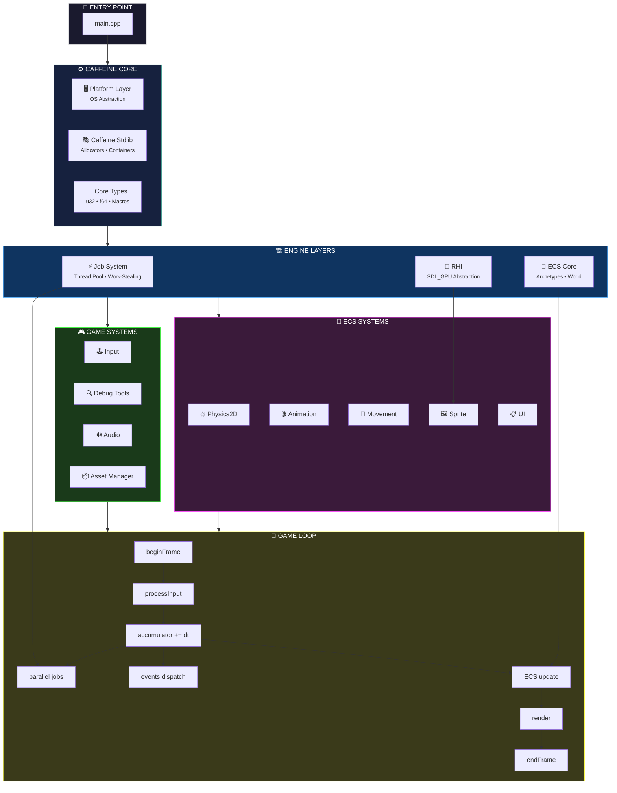
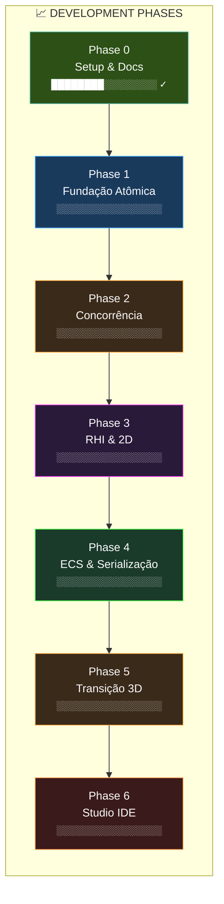
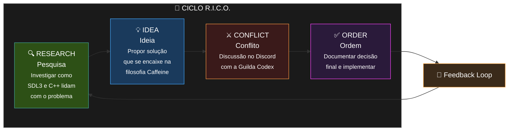
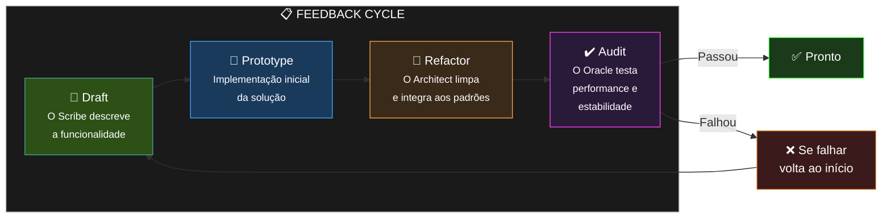
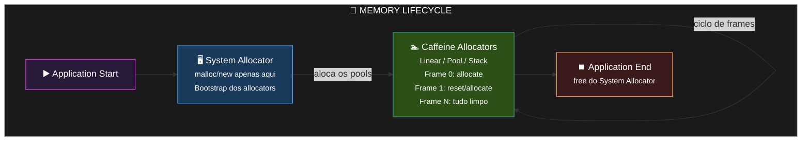
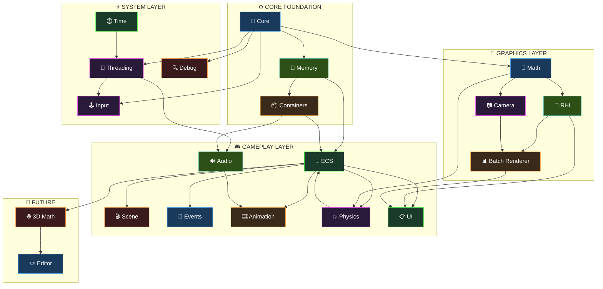
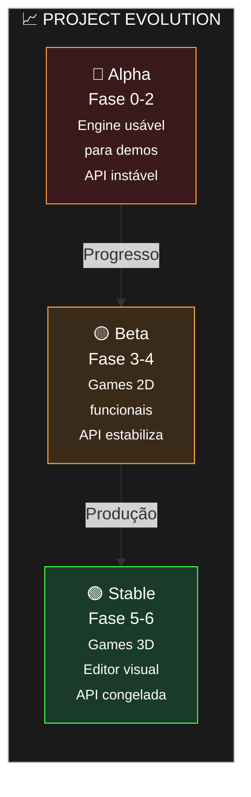

# ☕ Caffeine Engine — Documentação Mestre

**Versão:** 1.1.0  
**Status:** Alpha (Pré-produção)  
**Última Atualização:** 2026-04-06  
**Mantido por:** Codex Studio Guild

---

## Índice

1. [Visão Geral](#1-visão-geral)
2. [Filosofia & Princípios](#2-filosofia--princípios)
3. [Arquitetura do Sistema](#3-arquitetura-do-sistema)
4. [Fases de Desenvolvimento](#4-fases-de-desenvolvimento)
5. [Convenções de Código](#5-convenções-de-código)
6. [Fluxo de Trabalho (R.I.C.O.)](#6-fluxo-de-trabalho-rico)
7. [Estrutura de Diretórios](#7-estrutura-de-diretórios)
8. [Gestão de Memória](#8-gestão-de-memória)
9. [Módulos da Engine](#9-módulos-da-engine)
10. [Estratégia de Crescimento](#10-estratégia-de-crescimento)
11. [Como Contribuir](#11-como-contribuir)

---

## 1. Visão Geral

### 1.1 O que é a Caffeine?

A **Caffeine Engine** é uma game engine proprietária do Codex Studio, desenvolvida em **C++** sobre a camada do **SDL3**.

A Caffeine prioriza:
- **Controle total** sobre o hardware
- **Concorrência multithread** cada núcleo da CPU
- **Gerenciamento de memória** customizado, sem dependência da `std`
- **Otimização gráfica** de baixo nível via SDL_GPU

### 1.2 Objetivos do Projeto

| Objetivo | Descrição |
|---|---|
| **Performance** | Games que rodam 60fps+ em hardware modesto |
| **Transparência** | Cada desenvolvedor entende o que o código faz |
| **Modularidade** | Compilar sem áudio não quebra renderização |
| **Portabilidade** | Core agnóstico de plataforma (Windows/Linux/macOS) |
| **Manutenibilidade** | Código que o "eu do futuro" não odiará ler |

### 1.3 Stack Tecnológica

| Camada | Tecnologia |
|---|---|
| **Linguagem** | C++20 ou superior |
| **Gráficos** | SDL3 (SDL_GPU API) |
| **Build** | CMake 3.20+ |
| **Biblioteca Padrão** | Caffeine Stdlib (custom, zero `std` dependency) |

### 1.4 Status Atual

O projeto está em **Fase 0 — Setup Inicial & Documentação**. O código-fonte ainda não foi criado. Toda a arquitetura foi planejada e documentada; o próximo passo é implementar a **Fase 1: Fundação Atômica**.

---

## 2. Filosofia & Princípios

### 2.1 Os Três Pilares



### 2.2 Regras de Segurança (The Golden Rules)

1. **Memória:** Proibido `new` e `delete` soltos. Toda alocação passa pelos **Custom Allocators** da Caffeine.
2. **Ownership:** Preferir ponteiros brutos (`raw pointers`) com ciclo de vida garantido pelo Core. Usar `unique_ptr`/`shared_ptr` apenas quando estritamente necessário.
3. **Review:** Nenhum código entra na `main` sem Code Review de pelo menos um Architect.
4. **Testes:** Cada fase deve passar por **Stress Test** antes de avançar. A Fase N+1 não começa se a Fase N vazar memória ou for instável.
5. **Documentação:** Nenhuma função é aceita sem comentário no header (`.h`).

### 2.3 Princípios de Desenvolvimento

| Princípio | Significado |
|---|---|
| **YAGNI** | "You Ain't Gonna Need It" — não crie abstrações para problemas que ainda não existem |
| **DOD** | Data-Oriented Design — arrays contíguos, não hierarquias de herança profundas |
| **KISS** | "Keep It Simple, Stupid" — se a explicação é mais complexa que o código, simplifique o sistema |
| **AGNOSTICISM** | Toda spec deve prever que o dado pode ser 2D ou 3D |
| **SYNCHRONY** | Se o código mudar drasticamente, o documento correspondente **deve** ser atualizado no mesmo commit |

### 2.4 O Compromisso da Guilda

> *"Nós, os desenvolvedores da Caffeine, priorizamos a compreensão sobre a facilidade. Escrevemos código que nossos 'eus' do futuro não odiarão ler. Construímos para durar, um frame de cada vez."*

---

## 3. Arquitetura do Sistema

### 3.1 Visão Macro da Arquitetura



### 3.2 Camadas e Responsabilidades

#### Plataforma (Platform Layer)
- Isola código específico de OS (Windows/Linux/macOS)
- Abstrai syscalls de thread, tempo e arquivo
- Localização: `/platform/`

#### Caffeine Core (Tipos & Macros)
- Tipos de largura fixa: `u8`, `u16`, `u32`, `u64`, `i8`, `i16`, `i32`, `i64`, `f32`, `f64`
- Macros de plataforma, assertions customizados
- Macros de debug: `CF_ASSERT`, `CF_UNREACHABLE`, etc.

#### Caffeine Stdlib
- **Custom Allocators:** Linear, Pool, Stack
- **Containers:** `Caffeine::Vector`, `Caffeine::HashMap`, `StringView`, `FixedString`
- Zero dependência da `std` padrão

#### Job System
- Worker threads em repouso que acordam para processar Jobs
- Física, IA e Carregamento como Jobs discretos
- Atômicos e barreiras de sincronização lock-free

#### Game Systems (Fase 2-4)
- **Input Manager:** Action mapping, polling/event-driven, gamepad
- **Debug Tools:** Logging, profiler, debug draw
- **Audio System:** SDL3 audio, pooling, spatial 2D
- **Asset Manager:** Async loading, cache, hot-reload

#### RHI (Rendering Hardware Interface)
- Abstração sobre SDL_GPU
- Recebe `DrawCommand` → fila interna → GPU
- Não chama "SDL_Draw" diretamente

#### ECS (Entity Component System)
- Entidades = IDs (não objetos)
- Componentes = dados em arrays contíguos
- Sistemas = lógica que opera nos componentes

#### ECS Systems (Fase 4+)
- **PhysicsSystem2D:** AABB/circle collision, rigid body dynamics
- **AnimationSystem:** Sprite frames, state machine
- **UISystem:** Retained mode, ECS integration
- **MovementSystem:** Velocity/position integration

---

## 4. Fases de Desenvolvimento

### 4.1 Mapa de Fases



### 4.2 Detalhamento por Fase

---

#### 🔧 Fase 0: Setup Inicial & Documentação
**Status:** 🕒 Em Progresso  
**Responsável:** Guilda Codex

- [x] README.md criado
- [x] Manifesto de desenvolvimento criado
- [x] Roadmap de 6 fases documentado
- [x] Fluxo R.I.C.O. estabelecido
- [ ] Estrutura de diretórios `/src` criada
- [ ] `.gitignore` verificado e completo
- [ ] CMakeLists.txt base criado
- [ ] `Caffeine.h` com tipos básicos criado

---

#### 🧱 Fase 1: Fundação Atômica (Kernel & Memory)
**Status:** 📅 Planejado  
**Responsável:** Architects

**Entregáveis:**

1. **Caffeine Core Types & Macros**
   - Definição de tipos: `u8..u64`, `i8..i64`, `f32`, `f64`, `bool`, `char`
   - Macros de plataforma: `CF_PLATFORM_WINDOWS`, `CF_PLATFORM_LINUX`, `CF_PLATFORM_MAC`
   - Assertions: `CF_ASSERT(condition, message)`
   - Macros de debug: `CF_UNREACHABLE`, `CF_INVALID_DEFAULT`
   - `static_assert` para tamanhos de tipos

2. **Memory Management System (Allocators)**
   - **Linear Allocator:** limpa a cada frame, para memória volátil
   - **Pool Allocator:** aloca blocos de tamanho fixo (partículas, projéteis)
   - **Stack Allocator:** escopos aninhados (níveis de jogo)
   - Interface unificada: `IAllocator` com `alloc()`, `free()`, `realloc()`

3. **Custom Strings & Containers**
   - `StringView`: string sem ownership (ponteiro + tamanho)
   - `FixedString<T>`: string com buffer inline (sem alocação heap)
   - `Caffeine::Vector<T>`: array dinâmico otimizado para cache
   - `Caffeine::HashMap<K, V>`: tabela hash para lookup O(1)

**Critério de Progresso:** Stress test de alocação — 1M allocs sem leak, sem fragmentação mensurável.

**Arquivos a criar:**
```
src/
├── core/
│   ├── Caffeine.h          # Tipos e macros globais
│   ├── Caffeine.hpp        # Includes do core
│   ├── Types.hpp           # Definições de tipos
│   ├── Platform.hpp        # Macros de plataforma
│   ├── Assertions.hpp      # Sistema de assertions
│   └── Compiler.hpp        # Macros de compilador
├── memory/
│   ├── Allocator.hpp       # Interface base
│   ├── LinearAllocator.hpp
│   ├── PoolAllocator.hpp
│   └── StackAllocator.hpp
├── containers/
│   ├── Vector.hpp
│   ├── HashMap.hpp
│   ├── StringView.hpp
│   └── FixedString.hpp
└── CMakeLists.txt
```

---

#### ⚡ Fase 2: O Pulso e a Concorrência (Multithreading & Timing)
**Status:** 📅 Planejado  
**Responsável:** Architects

**Entregáveis:**

1. **High-Resolution Timer**
   - Precisão de microssegundos via `SDL_GetPerformanceCounter`
   - `TimePoint`, `Duration` com conversão entre unidades (ms, us, ns)
   - Métricas: FPS counter, frame time, delta time

2. **Job System (Worker Threads)**
   - Thread pool com N workers (N = `std::thread::hardware_concurrency() - 1`)
   - Fila de jobs atômica (lock-free queue)
   - Tipos de Job: `IJob`, `JobWithData<T>`, dependências entre Jobs
   - `JobHandle` para tracking e sincronização
   - Barreiras: `JobBarrier`, `JobSignal`

3. **The Master Game Loop**
   - Fixed timestep para lógica/física (ex: 60 updates/segundo)
   - Variable timestep para renderização
   - Interpolação de frames para fluidez visual
   - Sistema de eventos de alta precisão
   - Estados: `INIT`, `RUNNING`, `PAUSED`, `SHUTDOWN`

**Critério de Progresso:** Physics demo com 10K partículas, todos os núcleos a 80%+ carga, sem race conditions (tsan clean).

---

#### 👁️ Fase 3: O Olho da Engine (RHI & 2D Foundation)
**Status:** 📅 Planejado  
**Responsável:** Artisans / Architects

**Entregáveis:**

1. **Rendering Hardware Interface (RHI)**
   - Abstração sobre `SDL_GPU`
   - `DrawCommand` struct: tipo, vértices, textura, shader, transform
   - Command queue interna com batch automático
   - Swapchain management (double/triple buffering)
   - Suporte a múltiplos render targets

2. **2D Batch Renderer**
   - Batching de milhares de sprites em um único draw call
   - Textures atlas system
   - Z-buffer para ordenação (parallax, camadas)
   - Render groups: Background, Foreground, UI
   - Shader system básico (vertex + fragment)

3. **Camera System (Agnóstico)**
   - Matriz 4×4 de transformação
   - Projeção Ortográfica (2D atual)
   - Projeção Perspectiva (3D futuro — já previsto na API)
   - Follow camera, shake, zoom
   - Viewport management (letterbox, stretch)

**Critério de Progresso:** Demo com 50K sprites na tela a 60fps estável.

---

#### 🧠 Fase 4: O Cérebro (ECS & Serialização)
**Status:** 📅 Planejado  
**Responsável:** Architects

**Entregáveis:**

1. **Entity Component System (ECS)**
   - `Entity` = ID (32-bit ou 64-bit)
   - `Component` = struct de dados puro (sem métodos, sem virtual)
   - `ComponentPool<T>` = array contíguo de T, tumbuh como Vector
   - `World` = gerenciador de entidades e componentes
   - `System` = functor que opera sobre componentes específicos
   - Arquitetura archetype-based para cache locality

2. **Scene Graph & Serialização**
   - Hierarquia de entidades (parent/child)
   - `Caffeine Object Notation` (formato binário `.caf`)
   - Serialização JSON para debug e interoperabilidade
   - Save/Load de cenas completas
   - Base para futura IDE

3. **Event Bus**
   - Sistema pub/sub sem acoplamento
   - `Event<T>` com tipo explícito
   - Fila de eventos com priority
   - Exemplo: "Evento de Morte" → Sistema de Som toca clipe, Sistema de Partículas spawna efeito

**Critério de Progresso:** Demo com 100 entidades dinâmicas, 5+ sistemas rodando, serialização funcionando end-to-end.

---

#### 🌐 Fase 5: Transição Dimensional (The 3D Leap)
**Status:** 📅 Planejado  
**Responsável:** Artisans

**Entregáveis:**

1. **3D Math Extension**
   - Quaternions completos (multiplicação, slerp, look rotation)
   - Matrizes de transformação 3D (model, view, projection)
   - Planos, rays, bounding volumes (AABB, Sphere)
   - math.hpp extensão com SIMD hints

2. **Mesh Loading & Shaders**
   - Loader para `.obj` e `.gltf` (GL Transmission Format)
   - Pipeline de shaders: HLSL (Windows), GLSL (Linux/macOS)
   - Shader hot-reload para development
   - Material system com PBR (Physically Based Rendering)

3. **Spatial Partitioning**
   - Quadtree para mundos 2D grandes
   - Octree evoluindo naturalmente para 3D
   - Broad phase collision detection
   - Culling system (frustum + occlusion)

**Critério de Progresso:** Demo 3D com malha carregada, shader customizado, 60fps.

---

#### 🏛️ Fase 6: O Olimpo (Caffeine Studio IDE)
**Status:** 📅 Planejado  
**Responsável:** Full Guild

**Entregáveis:**

1. **Embedded UI (Dear ImGui)**
   - Editor in-engine para variáveis runtime
   - Profiler de frames e Jobs
   - Visualizador de memória e allocators
   - Console de comandos

2. **The Scene Editor**
   - Drag-and-drop de entidades
   - Inspector de componentes
   - Hierarquia visual de cena
   - Play/pause/step do game loop

3. **Asset Pipeline**
   - Processador de texturas (compressão, mipmaps)
   - Conversor de áudio (PCM → OGG)
   - Packer de assets em `.caf` bundles
   - Hot-reload de assets em runtime

**Critério de Progresso:** Primeira versão jogável de um game completo feito 100% na Caffeine.

---

## 5. Convenções de Código

### 5.1 Nomenclatura

| Elemento | Padrão | Exemplo |
|---|---|---|
| **Namespace** | `PascalCase` | `Caffeine::Memory` |
| **Classe / Struct** | `PascalCase` | `ThreadManager`, `LinearAllocator` |
| **Função / Método** | `camelCase` | `initSdl()`, `allocate()`, `getEntity()` |
| **Variável** | `camelCase` | `entityCount`, `playerHealth` |
| **Variável Privada** | `m_prefixo` | `m_isRunning`, `m_allocator` |
| **Constante / Macro** | `UPPER_CASE` | `MAX_THREADS`, `CF_PLATFORM_WINDOWS` |
| **Membro Estático** | `s_prefixo` | `s_instanceCount` |
| **Arquivo Header** | `PascalCase.hpp` | `LinearAllocator.hpp` |
| **Arquivo Source** | `PascalCase.cpp` | `LinearAllocator.cpp` |

### 5.2 Tipos Customizados

```cpp
// Tipos unsigned
using u8  = std::uint8_t;
using u16 = std::uint16_t;
using u32 = std::uint32_t;
using u64 = std::uint64_t;

// Tipos signed
using i8  = std::int8_t;
using i16 = std::int16_t;
using i32 = std::int32_t;
using i64 = std::int64_t;

// Tipos float
using f32 = float;
using f64 = double;

// Tamanhos garantidos
static_assert(sizeof(u32) == 4, "u32 must be 4 bytes");
static_assert(sizeof(f64) == 8, "f64 must be 8 bytes");
```

### 5.3 Padrões de Interface

#### Allocators
```cpp
class IAllocator {
public:
    virtual ~IAllocator() = default;
    virtual void* alloc(usize size, usize alignment = 8) = 0;
    virtual void free(void* ptr) = 0;
    virtual void reset() = 0;  // Para Linear e Stack allocators
    virtual usize usedMemory() const = 0;
};
```

#### Jobs
```cpp
struct IJob {
    virtual ~IJob() = default;
    virtual void execute() = 0;
};

template<typename T>
struct JobWithData : IJob {
    T data;
    std::function<void(T&)> func;
    void execute() override { func(data); }
};
```

#### ECS Components (Plain Old Data)
```cpp
struct Position {
    f32 x, y, z;
};

struct Sprite {
    u32 textureId;
    u32 width, height;
    f32 scaleX, scaleY;
};
// SEM métodos, SEM virtual, SEM construtores customizados
```

### 5.4 Regras de Estilo

1. **Indentação:** 4 espaços (não tabs)
2. **Chaves:** BSD style (K&R variant):
   ```cpp
   if (condition) {
       doSomething();
   } else {
       doOther();
   }
   ```
3. **Linha máxima:** 120 caracteres
4. **Namespace:** Todo código em `Caffeine::*`
5. **Headers:** `#pragma once` (não include guards tradicionais)
6. **Includes:** Ordem — related header → local → third-party → system
7. **Comentários:** Doxygen para APIs públicas, `// inline` para código não óbvio

---

## 6. Fluxo de Trabalho (R.I.C.O.)

O ciclo **R.I.C.O.** é o processo de tomada de decisão da Caffeine:



### 6.1 Research (Pesquisa)
- Investigar como SDL3 ou C++ padrão lidam com o problema
- Buscar em documentação oficial, código de referência, papers
- Não reinventar sem antes entender o que já existe

### 6.2 Idea (Ideia)
- Propor solução que se encaixe na filosofia de baixa dependência
- Considerar trade-offs: performance vs manutenibilidade vs portabilidade
- Documentar a proposta com código mockup ou diagrama

### 6.3 Conflict (Conflito)
- Discussão no Discord da Guilda Codex
- Pergunta-chave: "Essa solução fere o desempenho ou a portabilidade 3D futura?"
- Se não houver consenso, o Architect mais sênior decide

### 6.4 Order (Ordem)
- Documentar a decisão final em `/desing_planning/`
- Atualizar spec correspondente
- Criar issue/ticket para implementação
- **Mesmo commit** atualiza código E documentação

### 6.5 Ciclo de Feedback (Draft → Prototype → Refactor → Audit)



---

## 7. Estrutura de Diretórios

```
caffeine/
├── README.md
├── LICENSE
├── CMakeLists.txt              # Build principal
├── .gitignore
│
├── desing_planning/            # ← Documentação de design (atual)
│   ├── README.md
│   ├── dev_manifesto.md        # Leis do projeto
│   ├── roadmap.md              # Fases de 1 a 6
│   ├── architecture_specs.md    # (futuro) ECS, Job System, RHI specs
│   ├── memory_model.md          # (futuro) Specs de allocators
│   └── master_plan.md          # (futuro) Roadmap detalhado
│
├── docs/                       # ← Documentação pública
│   ├── MASTER.md               # Este arquivo
│   ├── architecture/
│   ├── api/
│   └── guides/
│
├── src/                        # ← Código-fonte (a criar na Fase 1)
│   ├── Caffeine.hpp            # Header principal de inclusão
│   ├── Caffeine.cpp            # Entry point mínimo
│   │
│   ├── core/                   # Tipos, macros, platform
│   │   ├── Types.hpp
│   │   ├── Platform.hpp
│   │   ├── Assertions.hpp
│   │   └── Compiler.hpp
│   │
│   ├── memory/                 # Custom Allocators
│   │   ├── Allocator.hpp
│   │   ├── LinearAllocator.hpp
│   │   ├── PoolAllocator.hpp
│   │   └── StackAllocator.hpp
│   │
│   ├── containers/             # Caffeine Stdlib containers
│   │   ├── Vector.hpp
│   │   ├── HashMap.hpp
│   │   ├── StringView.hpp
│   │   └── FixedString.hpp
│   │
│   ├── threading/              # Job System (Fase 2)
│   │   ├── ThreadPool.hpp
│   │   ├── JobSystem.hpp
│   │   └── JobQueue.hpp
│   │
│   ├── time/                   # Timing (Fase 2)
│   │   ├── Timer.hpp
│   │   └── GameLoop.hpp
│   │
│   ├── rhi/                    # Rendering Hardware Interface (Fase 3)
│   │   ├── RHI.hpp
│   │   ├── DrawCommand.hpp
│   │   ├── BatchRenderer.hpp
│   │   └── Shader.hpp
│   │
│   ├── camera/                # Sistema de câmera (Fase 3)
│   │   └── Camera.hpp
│   │
│   ├── ecs/                   # ECS Core (Fase 4)
│   │   ├── World.hpp
│   │   ├── Entity.hpp
│   │   ├── ComponentPool.hpp
│   │   └── System.hpp
│   │
│   ├── scene/                 # Scene Graph (Fase 4)
│   │   ├── Scene.hpp
│   │   └── Serializer.hpp
│   │
│   ├── events/                # Event Bus (Fase 4)
│   │   ├── EventBus.hpp
│   │   └── Event.hpp
│   │
│   ├── platform/              # Abstração de OS
│   │   ├── Platform.hpp
│   │   ├── Platform_Windows.hpp
│   │   ├── Platform_Linux.hpp
│   │   └── Platform_Mac.hpp
│   │
│   ├── math/                  # Biblioteca matemática
│   │   ├── Vec2.hpp
│   │   ├── Vec3.hpp
│   │   ├── Vec4.hpp
│   │   ├── Mat4.hpp
│   │   ├── Quaternion.hpp
│   │   └── Math.hpp
│   │
│   └── [3d/]                  # Extensões 3D (Fase 5)
│   └── [editor/]              # IDE (Fase 6)
│
├── tests/                      # ← Testes unitários
│   ├── memory/
│   ├── containers/
│   ├── ecs/
│   └── CMakeLists.txt
│
├── examples/                   # ← Demos e exemplos
│   ├── 01_hello_world/
│   ├── 02_particles/
│   ├── 03_ecs_demo/
│   └── CMakeLists.txt
│
└── tools/                      # ← Ferramentas internas
    ├── asset_packer/
    └── shader_compiler/
```

---

## 8. Gestão de Memória

### 8.1 Philosophy

A Caffeine **NUNCA** permite `new` ou `delete` no código da aplicação. Toda alocação passa por um dos allocators customizados.

### 8.2 Os Três Allocators

#### Linear Allocator
- **Uso:** Memória volátil por frame (scratch space)
- **Comportamento:** `allocate()` avança um cursor; `reset()` volta ao início
- **Custo:** O(1) sem fragmentação
- **Exemplo:** Transform temporário dentro de um sistema

#### Pool Allocator
- **Uso:** Blocos de tamanho fixo e repetitivo
- **Comportamento:** Divide um bloco grande em slots iguais; aloca do primeiro livre
- **Custo:** O(1) amortizado
- **Exemplo:** Partículas (todas do mesmo tamanho), projéteis, eventos

#### Stack Allocator
- **Uso:** Escopos aninhados com alocações e freesOrdered
- **Comportamento:** Marca checkpoints (`Marker`); free volta ao marker
- **Custo:** O(1) sem fragmentação
- **Exemplo:** Carregar um nível de jogo — todas as entidades alocadas no stack; ao descarregar, volta ao marker

### 8.3 Ciclo de Vida da Memória



### 8.4 Allocator Registry

Para debugging e profiling, todo allocator é registrado:

```cpp
struct AllocatorStats {
    const char* name;
    usize totalSize;
    usize usedMemory;
    usize peakMemory;
    usize allocationCount;
};

class AllocatorRegistry {
public:
    static void registerAllocator(IAllocator* alloc, const char* name);
    static void unregisterAllocator(IAllocator* alloc);
    static void printReport();  // Debug only
};
```

---

## 9. Módulos da Engine

Cada módulo deve ser **independente** — compilável sem os outros.

### 9.1 Módulos Obrigatórios (Core)

| Módulo | Descrição | Fase |
|---|---|---|
| **Core** | Tipos, macros, platform | 1 |
| **Memory** | Allocators customizados | 1 |
| **Containers** | Vector, HashMap, Strings | 1 |
| **Math** | Vetores, matrizes, quaternions | 1+ |
| **Threading** | Job System, thread pool | 2 |
| **Time** | Timer, game loop | 2 |

### 9.2 Módulos de Gameplay (Engine)

| Módulo | Descrição | Fase | Dependência |
|---|---|---|---|
| **Input** | Action mapping, polling/event-driven | 2 | Core |
| **Debug Tools** | Logging, profiler, debug draw | 2+ | Core |
| **Asset Manager** | Async loading, cache, hot-reload | 3 | Job System |
| **RHI** | Abstração SDL_GPU | 3 | Core |
| **Batch Renderer** | Sprite batching, texture atlas | 3 | RHI |
| **Camera** | Sistema de câmera | 3 | Math |
| **ECS** | Entity Component System | 4 | Core, Memory |
| **Scene** | Serialização, scene graph | 4 | ECS, Asset |
| **Events** | Event bus | 4 | ECS |
| **Audio** | SDL3 audio, pooling, spatial | 4 | Asset |
| **Animation** | Sprite frames, state machine | 4 | ECS, Asset |
| **Physics (2D)** | AABB, collision, integration | 4 | ECS, Math |
| **UI** | Retained mode, ECS integration | 5 | ECS, Render |

### 9.3 Dependências entre Módulos



### 9.4 Mapa de Uso de Memória por Sistema

| Sistema | Allocator | Justificativa |
|---|---|---|
| **Game Loop** | Linear (frame) | Reset a cada frame |
| **Job System** | Linear (scratch) + Stack (task) | Task scopes |
| **Input** | Pool | Gamepad state, bindings |
| **Event Bus** | Linear (frame) | Fila de eventos |
| **ECS** | Pool + Persistent | Component storage |
| **Physics** | Linear (frame) | Contact manifolds |
| **Audio** | Pool | AudioSource instances |
| **Animation** | Pool | Animator instances |
| **UI** | Pool | Widget instances |
| **Scene** | Stack (level) | Load/unload arena |
| **Asset Manager** | Persistent + Linear | Registry + load buffer |

> Para detalhes completos, ver [`desing_planning/memory_model.md`](../desing_planning/memory_model.md).

---

## 10. Estratégia de Crescimento

### 10.1 Como o Projeto Deve Evoluir



### 10.2 Critérios para Avançar de Fase

1. **Stress Test Passed:** O sistema atual não vaza memória nem causa crashes sob carga
2. **API Estável:** A interface pública não mudou nos últimos 2 sprints
3. **Documentação Atualizada:** Todos os novos subsistemas têm spec documentada
4. **Code Review:** Pelo menos 1 Architect aprovou cada arquivo modificado
5. **Testes:** Cobertura mínima de 80% nos módulos core

### 10.3 Regras de Crescimento

1. **Modularidade First:** Adicionar funcionalidade como módulo novo, não acoplado
2. **Performance Budget:** Nova funcionalidade não pode degradar FPS do boilerplate em mais de 1%
3. **Portabilidade por Defualt:** Código novo deve compilar em Windows E Linux E macOS
4. **Deprecation Policy:** Se uma API mudar, manter compatibilidade backwards por 2 fases
5. **Versionamento Semântico:**
   - `MAJOR`: Quebra de compatibilidade (ex: API do ECS mudou)
   - `MINOR`: Nova funcionalidade (ex: Camera shake adicionado)
   - `PATCH`: Bug fixes (ex: memory leak no PoolAllocator corrigido)

---

## 11. Como Contribuir

### 11.1 Para Arquitetos (Implementação)

1. **Consultar R.I.C.O.:** Antes de implementar, seguir o ciclo Research → Idea → Conflict → Order
2. **Criar Branch:** `feature/fase-N-nome-da-feature`
3. **Implementar:** Seguir convenções de código (Seção 5)
4. **Code Review:** Pull Request com pelo menos 1 aprovação
5. **Merge:** Squash merge para manter histórico limpo
6. **Documentar:** Spec e código no mesmo commit

### 11.2 Para Scribes (Documentação)

1. **Antes de Codificar:** A spec deve existir em `/desing_planning/`
2. **Sincronia:** Se o código mudou, o doc mudou no mesmo commit
3. **Clareza:** "Se a explicação é mais complexa que o código, o sistema precisa ser simplificado"
4. **AGNOSTICISM:** Toda spec deve prever 2D e 3D

### 11.3 Fluxo Git

```
feature/fase-1-linear-allocator
        │
        ├── Implementa LinearAllocator
        ├── Escreve testes
        ├── Atualiza memory_model.md
        ├── Code Review aprovação
        │
        ▼
      Squash Merge → main
        │
        ▼
    Tag: v0.1.0-alpha
```

### 11.4 Checklist Antes de Commitar

- [ ] Código compila em todas as plataformas
- [ ] Sem `new` ou `delete` soltos
- [ ] Nomenclatura segue o Style Guide
- [ ] Headers têm documentação Doxygen
- [ ] Documentação correspondente atualizada
- [ ] `.gitignore` não vai incluir artefatos de build

---

## Apêndice A: Glossário

| Termo | Definição |
|---|---|
| **RHI** | Rendering Hardware Interface — abstração sobre a API gráfica |
| **ECS** | Entity Component System — arquitetura de dados para jogos |
| **DOD** | Data-Oriented Design — organização de dados para cache locality |
| **YAGNI** | You Ain't Gonna Need It — não implementar o que não é necessário |
| **Lock-free** | Algoritmo que não usa locks, apenas atômicos |
| **Archetype** | Grupo de entidades com o mesmo conjunto de componentes |
| **Draw Call** | Comando enviado à GPU para renderizar geometria |
| **Batch Rendering** | Agrupar múltiplos draw calls em um único |
| **SIMD** | Single Instruction Multiple Data — instruções vetoriais da CPU |
| **Cache Locality** | Padrão de acesso à memória que maximiza hits de cache |
| **Swapchain** | Buffer de frames para double/triple buffering |

---

## Apêndice B: Referências e Recursos

### Documentação
- [SDL3 Documentation](https://wiki.libsdl.org/)
- [SDL_GPU API](https://github.com/libsdl-org/SDL_gpu/)
- [C++20 Standard](https://en.cppreference.com/)

### Livros e Conceitos
- [Data-Oriented Design — Richard Fabian](https://www.dataorienteddesign.com/)
- [Game Programming Patterns — Robert Nystrom](https://gameprogrammingpatterns.com/)
- [Game Engine Architecture — Jason Gregory](https://www.gameenginebook.com/)

### Engines e Bibliotecas de Referência
- [flecs](https://github.com/SanderMertens/flecs) — ECS archetype-based com cache locality
- [EnTT](https://github.com/skypjack/entt) — ECS patterns e integração com game loops
- [Jolt Physics](https://github.com/jrouwe/JoltPhysics) — Job System com barreiras
- [Box2D/LiquidFun](https://github.com/google/liquidfun) — Física 2D com broad/narrow phase

### Padrões de Game Loop
- [Handmade Hero](https://github.com/cmuratori/HandmadeHeroCode) — Padrões de engine de baixo nível
- [Fixed Timestep Demo](https://github.com/jakubtomsu/fixed-timestep-demo) — Padrão accumulator com interpolação
- [Dear ImGui SDL3](https://github.com/ocornut/imgui/blob/master/examples/example_sdl3_opengl3/main.cpp) — SDL3 game loop integration

### Patterns de Código
- [Endurodave StateMachine](https://github.com/endurodave/StateMachine) — State machine patterns em C++
- [Merrilledmonds GameLoop](https://github.com/merrilledmonds/GameLoop) — Boilerplate game loop modular

---

> ☕ *"Caffeine: Because great games are built on strong code and a lot of coffee."*
