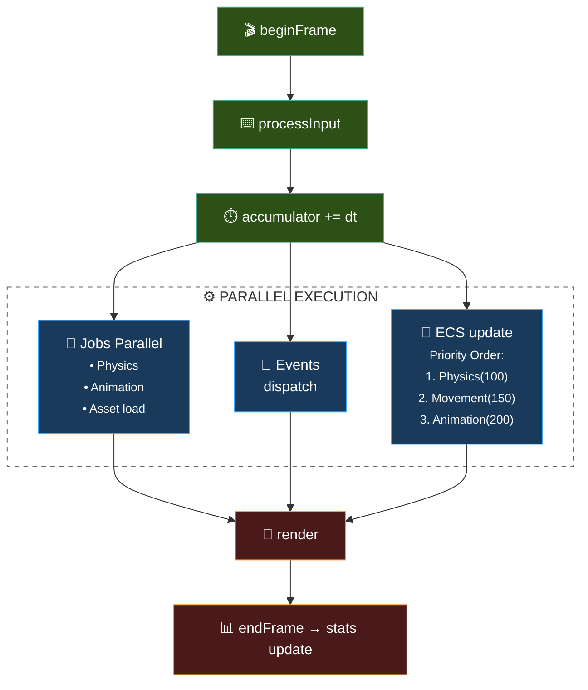
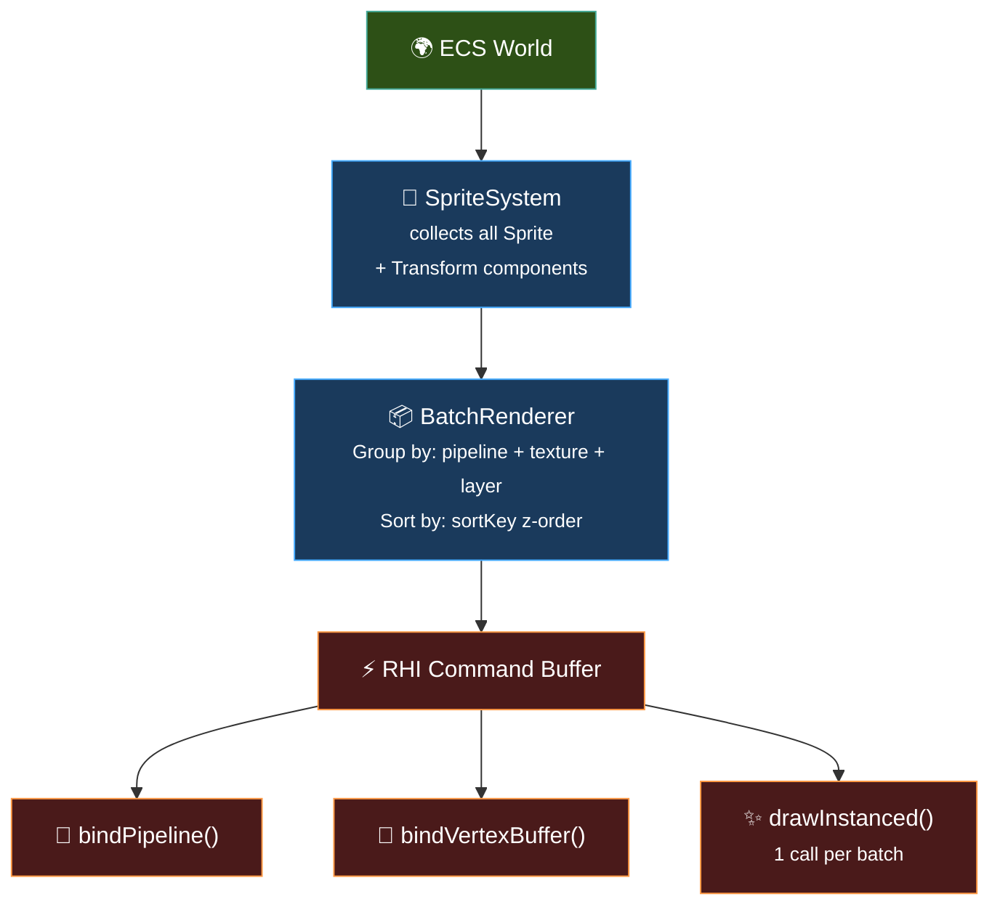
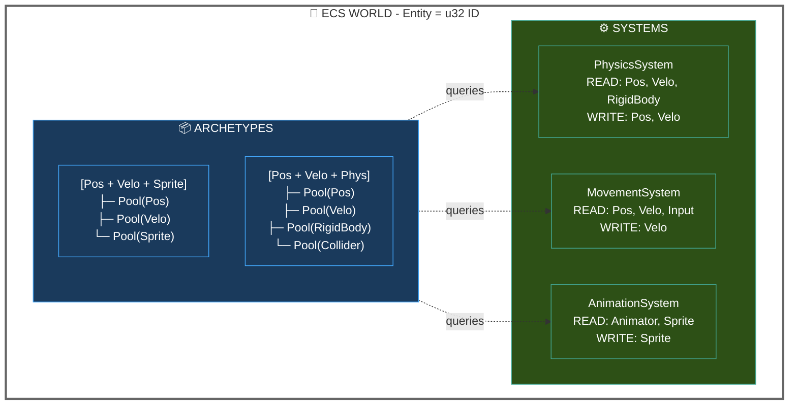
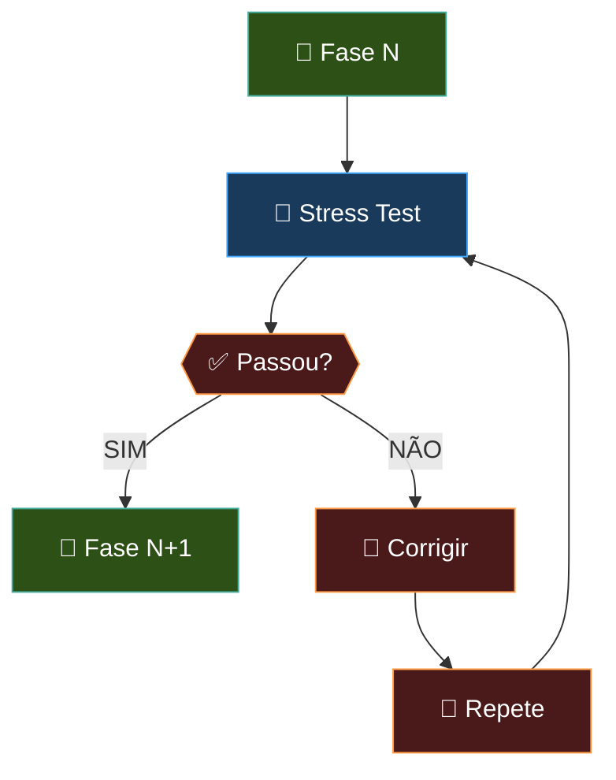

# 🗺️ Roadmap de Desenvolvimento

Visão executiva das 6 fases do projeto. Para **detalhes técnicos completos** de cada fase (arquitetura, arquivos, critérios de progresso), consulte [`docs/README.md`](docs/README.md) §4 e [`architecture_specs.md`](architecture_specs.md) para APIs completas.

> **Legenda de Princípios:**
> - **DOD** = Data-Oriented Design — organização de dados para cache locality
> - **YAGNI** = You Ain't Gonna Need It — não implementar o que não é necessário
> - **KISS** = Keep It Simple, Stupid — simplicidade acima de tudo
> - **RHI** = Rendering Hardware Interface — abstração sobre a API gráfica
> - **ECS** = Entity Component System — arquitetura de dados para jogos
> - **Lock-free** = Algoritmo que não usa locks, apenas atômicos
> - **SIMD** = Single Instruction Multiple Data — instruções vetoriais da CPU
> - **Cache Locality** = Padrão de acesso à memória que maximiza hits de cache

---

## 📊 Status Geral

```
Fase 0: Setup & Docs       █████████░░░░░░  80%  ← ATUAL
Fase 1: Fundação Atômica   █████████████████ 100% ✅ COMPLETO
Fase 2: Concorrência        ░░░░░░░░░░░░░░░  0%
Fase 3: RHI & 2D            ░░░░░░░░░░░░░░░  0%
Fase 4: ECS & Sistemas      ░░░░░░░░░░░░░░░  0%
Fase 5: Transição 3D          ░░░░░░░░░░░░░░░  0%
Fase 6: Caffeine Studio IDE  ░░░░░░░░░░░░░░░  0%
```

---

## 🧱 Fase 1: Fundação Atômica

**Responsável:** Architects  
**Status:** ✅ Completo (testes passando em CI)

> Criar independência total da `std` e garantir controle absoluto do hardware.

### DOD (Data-Oriented Design)
- **Vector<T>**: Arrays contíguos em memória, alocação O(1), sem fragmentação
- **HashMap<K,V>**: Open addressing com linear probing para cache locality
- **StringView**: Zero-copy, apenas ponteiro + tamanho
- **FixedString<T,N>**: Buffer inline, zero heap allocations
- **Allocators**: Linear (frame), Pool (slots), Stack (markers) — nenhum malloc após bootstrap

### RFs (Requisitos Funcionais)

| ID | Requisito | Critério de Aceitação |
|----|-----------|----------------------|
| **RF1.1** | Tipos de largura fixa (u8..u64, i8..i64, f32, f64) | `static_assert` confirma tamanhos |
| **RF1.2** | Macros de plataforma (Windows/Linux/macOS) | Compila em todas as plataformas |
| **RF1.3** | Sistema de assertions customizável | CF_ASSERT funciona em debug |
| **RF1.4** | LinearAllocator com reset() O(1) | 1M allocs + reset < 10ms |
| **RF1.5** | PoolAllocator O(1) amortizado | Alocação de slots fixos |
| **RF1.6** | StackAllocator com markers | freeToMarker() funciona |
| **RF1.7** | Vector<T> cache-friendly | pushBack() não fragmenta memória |
| **RF1.8** | HashMap<K,V> O(1) lookup | Inserção e busca constant time |
| **RF1.9** | Math library (Vec2/3/4, Mat4) | Operações vetoriais corretas |

### Critério de Progresso
**Stress test:** 1M allocs → zero memory leaks, fragmentação < 0.1%.

### Entregáveis

```
src/
├── Caffeine.hpp                  # Header principal de inclusão
├── core/
│   ├── Types.hpp              # u32, f64, etc. + static_assert
│   ├── Platform.hpp           # Macros de plataforma
│   ├── Assertions.hpp         # CF_ASSERT, CF_UNREACHABLE
│   └── Compiler.hpp          # Macros de compilador
├── memory/
│   ├── Allocator.hpp         # Interface base IAllocator
│   ├── LinearAllocator.hpp   # O(1), reset()
│   ├── PoolAllocator.hpp     # Slots fixos, O(1) amortizado
│   └── StackAllocator.hpp     # Marcadores, O(1)
├── containers/
│   ├── Vector.hpp            # Array dinâmico cache-friendly
│   ├── HashMap.hpp          # Tabela hash O(1)
│   ├── StringView.hpp        # String sem ownership
│   └── FixedString.hpp       # Buffer inline, zero heap
└── math/
    ├── Vec2.hpp, Vec3.hpp, Vec4.hpp
    ├── Mat4.hpp              # Matriz 4×4 column-major
    └── Math.hpp             # Utility functions
```

### Testes CI
- ✅ test_core.cpp: 8 testes (Types, Constants, Platform, Compiler, Assertions)
- ✅ test_allocators.cpp: 16 testes + 3 stress tests (Linear, Pool, Stack)
- ✅ test_containers.cpp: 14 testes + 1 stress test (Vector, HashMap, StringView, FixedString)
- ✅ test_math.cpp: 18 testes (Vec2, Vec3, Vec4, Mat4, Math utilities)

---

## 📊 Status Geral

```
Fase 0: Setup & Docs       █████████░░░░░░  70%  ← ATUAL
Fase 1: Fundação Atômica   ░░░░░░░░░░░░░░░  0%
Fase 2: Concorrência        ░░░░░░░░░░░░░░░  0%
Fase 3: RHI & 2D            ░░░░░░░░░░░░░░░  0%
Fase 4: ECS & Sistemas      ░░░░░░░░░░░░░░░  0%
Fase 5: Transição 3D          ░░░░░░░░░░░░░░░  0%
Fase 6: Caffeine Studio IDE  ░░░░░░░░░░░░░░░  0%
```

---

## ⚡ Fase 2: O Pulso e a Concorrência

**Responsável:** Architects  
**Status:** 📅 Planejado

> Utilizar todos os núcleos da CPU e manter clock estável. Primeira camada de input e ferramentas de debug.

### Entregáveis

| Componente | Descrição | Arquivos |
|---|---|---|
| **High-Resolution Timer** | Precisão de microssegundos, `TimePoint`, `Duration` | `time/Timer.hpp` |
| **Job System** | Thread pool com workers, fila lock-free, `JobHandle` | `threading/JobSystem.hpp` |
| **Game Loop** | Fixed timestep + interpolation, state machine | `core/GameLoop.hpp` |
| **Input System** | Action mapping, polling/event-driven, gamepad | `input/InputManager.hpp` |
| **Debug Tools** | Logging, profiler, debug draw | `debug/LogSystem.hpp` |

### Ciclo de Game Loop



### DOD (Data-Oriented Design)
- **Job System**: Filas lock-free com atomic operations, zero locking overhead
- **Thread Pool**: Work-stealing algorithm para balanceamento de carga
- **Game Loop**: Fixed timestep buffer para consistência entre frames
- **Timer**: High-resolution via SDL_GetPerformanceCounter

### RFs (Requisitos Funcionais)

| ID | Requisito | Critério de Aceitação |
|----|-----------|----------------------|
| **RF2.1** | High-Resolution Timer | Precisão de microssegundos |
| **RF2.2** | Job System com workers | N workers = cores - 1 |
| **RF2.3** | Lock-free job queue | Zero locks no hot path |
| **RF2.4** | JobHandle para dependências | Jobs dependentes completam antes |
| **RF2.5** | Fixed timestep game loop | 60 updates/segundo fixo |
| **RF2.6** | Variable timestep render | Delta time variável |
| **RF2.7** | Input System (actions) | Action mapping, polling |
| **RF2.8** | Debug Tools (logging) | Log com níveis configuráveis |

### Critério de Progresso
**Physics demo:** 10K partículas, todos os núcleos a 80%+ carga, `tsan` clean.

---

## 👁️ Fase 3: O Olho da Engine

**Responsável:** Artisans / Architects  
**Status:** 📅 Planejado

> Construir a camada de renderização agnóstica e sistema de assets.

### Entregáveis

| Componente | Descrição | Dependência |
|---|---|---|
| **RHI** | Abstração sobre SDL_GPU, `DrawCommand` queue | Core |
| **Batch Renderer** | 50K sprites → 1 draw call | RHI |
| **Camera System** | Matriz 4×4, ortográfica (2D) / perspectiva (3D) | Math |
| **Asset Manager** | Async loading, cache, hot-reload | Job System |
| **Texture Atlas** | Bin-packing, UV coordinates | Asset Manager |

### Pipeline de Renderização



### DOD (Data-Oriented Design)
- **RHI**: Command buffer com batch automático, grouping por pipeline+texture+layer
- **Batch Renderer**: 50K sprites → 1 draw call através de instanced rendering
- **Texture Atlas**: Bin-packing para UV coordinates, cache-friendly
- **Camera**: Matriz 4×4 column-major, view/projection separation

### RFs (Requisitos Funcionais)

| ID | Requisito | Critério de Aceitação |
|----|-----------|----------------------|
| **RF3.1** | RHI abstraction | Abstração SDL_GPU, não chama SDL_Draw direto |
| **RF3.2** | DrawCommand queue | Command buffer com flush automático |
| **RF3.3** | Batch Renderer | 50K sprites → 1 draw call |
| **RF3.4** | Texture Atlas | Bin-packing, UV mapping correto |
| **RF3.5** | Camera 2D/3D | Projeção orto e perspectiva |
| **RF3.6** | Asset Manager async | Loading em background job |
| **RF3.7** | Hot-reload | Textures/shaders recarregáveis em runtime |

### Critério de Progresso
**Demo:** 50K sprites na tela a **60fps estável**.

---

## 🧠 Fase 4: O Cérebro

**Responsável:** Architects  
**Status:** 📅 Planejado

> ECS completo, sistemas de gameplay, comunicação desacoplada.

### Entregáveis

| Componente | Descrição | Dependência |
|---|---|---|
| **ECS Core** | Archetype-based, queries, systems | Core, Memory |
| **Scene Manager** | Hierarquia, transições, `.caf` serialization | ECS, Asset Manager |
| **Event Bus** | Pub/sub typed, fila com prioridade | ECS |
| **Audio System** | SDL3 audio, pooling, spatial 2D | Asset Manager |
| **Animation System** | Sprite frames, state machine | ECS, Asset Manager |
| **Physics (2D)** | AABB/circle collision, layers | ECS, Math |
| **UI System** | Retained mode, ECS integration | ECS, Render |

### Arquitetura ECS



### DOD (Data-Oriented Design)
- **ECS Archetype-based**: Entidades agrupadas por conjunto de componentes (cache locality)
- **Component Pools**: Arrays contíguos por tipo, não objetos por entidade
- **Query System**: Iteração sobre entidades que possuem X componentes
- **Event Bus**: Pub/sub sem acoplamento, fila com prioridade

### RFs (Requisitos Funcionais)

| ID | Requisito | Critério de Aceitação |
|----|-----------|----------------------|
| **RF4.1** | ECS Core (Archetype) | Entities = IDs, Components = dados contíguos |
| **RF4.2** | ComponentPool<T> | Arrays contíguos, grow como Vector |
| **RF4.3** | World query system | Query por combinação de componentes |
| **RF4.4** | Scene serialization | Save/load .caf formato binário |
| **RF4.5** | Event Bus pub/sub | Event<T> tipado, priority queue |
| **RF4.6** | Audio System | SDL3 audio, pooling, spatial 2D |
| **RF4.7** | Animation System | Sprite frames, state machine |
| **RF4.8** | Physics 2D | AABB/circle collision, layers |
| **RF4.9** | UI System (retained) | ECS integration, widget instances |

### Componentes ECS Pré-definidos

```cpp
// Transform
Position2D, Velocity2D, Rotation2D, WorldTransform, Parent

// Visual
Sprite, Animator, Camera2D

// Physics
RigidBody2D, Collider2D

// Audio
AudioEmitter, AudioRequest

// Tags
Player, Enemy, Projectile, Particle, Disabled, Destroy

// Meta
Name, SceneRef
```

### Critério de Progresso
**Demo:** 100 entidades dinâmicas, 5+ sistemas rodando, serialização end-to-end.

---

## 🌐 Fase 5: Transição Dimensional

**Responsável:** Artisans  
**Status:** 📅 Planejado

> Expansão para 3D sem quebrar o 2D existente.

### Entregáveis

| Componente | Descrição | Dependência |
|---|---|---|
| **3D Math Extension** | Quaternions, matrizes 3D, SIMD hints | Math |
| **Mesh Loading** | `.obj`, `.gltf`, shaders HLSL/GLSL | Asset Manager, RHI |
| **Spatial Partitioning** | Quadtree → Octree, frustum culling | Physics |
| **Camera3D** | Projeção perspectiva, lookAt | Math, Camera |
| **Skeletal Animation** | Bones, skinning, blend trees | Animation |

### DOD (Data-Oriented Design)
- **Quaternions**: Representação 4D para rotações 3D, SLERP interpolation
- **Octree**: Spatial partitioning para 3D, broad-phase collision
- **Mesh data**: Vertex buffers contíguos, index buffers, LOD support

### RFs (Requisitos Funcionais)

| ID | Requisito | Critério de Aceitação |
|----|-----------|----------------------|
| **RF5.1** | Quaternion math | Multiplicação, SLERP, look rotation |
| **RF5.2** | Mesh loader | .obj e .gltf carregamento |
| **RF5.3** | Shader system | HLSL (Windows) / GLSL (Linux/macOS) |
| **RF5.4** | Octree spatial | Broad-phase collision detection |
| **RF5.5** | Camera 3D | Projeção perspectiva, lookAt |
| **RF5.6** | Frustum culling | Objetos fora da view não renderizam |

### Critério de Progresso
**Demo:** Mesh 3D carregada, shader customizado, **60fps**.

---

## 🏛️ Fase 6: O Olimpo

**Responsável:** Full Guild  
**Status:** 📅 Planejado

> Transformar a engine em ferramenta visual para a comunidade.

### Entregáveis

| Componente | Descrição |
|---|---|
| **Embedded UI** | Dear ImGui, profiler, console, cvar system |
| **Scene Editor** | Drag-and-drop, inspector, hierarchy, gizmos |
| **Asset Pipeline** | Processador de textures/áudio → `.caf` bundles |
| **Scripting (TBD)** | Possível integração com Lua/AngelScript |

### DOD (Data-Oriented Design)
- **ImGui immediate mode**: Rendering direto ao buffer, sem scenegraph
- **Scene Editor**: Entity Inspector, Hierarchy view, Transform gizmos
- **Asset Pipeline**: Binary bundles (.caf), mipmap generation

### RFs (Requisitos Funcionais)

| ID | Requisito | Critério de Aceitação |
|----|-----------|----------------------|
| **RF6.1** | Embedded UI | Dear ImGui integrado |
| **RF6.2** | Profiler | Frame timing, memory profiling |
| **RF6.3** | Scene Editor | Drag-drop, inspector, hierarchy |
| **RF6.4** | Transform gizmos | Translate/Rotate/Scale visual |
| **RF6.5** | Asset Pipeline | Processador → .caf bundles |
| **RF6.6** | Hot-reload runtime | Textures/shaders recarregáveis |

### Critério de Progresso
**Primeiro game completo** feito 100% na Caffeine.

---

## 🚦 Gates Entre Fases

**Regra:** Não avançamos para a Fase N+1 enquanto a Fase N não passar no Stress Test.



### Stress Tests por Fase

| Fase | Teste | Benchmark |
|---|---|---|
| **1** | 1M allocs, 0 leaks | <0.1% fragmentação |
| **2** | 10K partículas, tsan/asan clean | 80%+ CPU em 8 cores |
| **3** | 50K sprites | 60fps, 1 draw call |
| **4** | 100 entidades, 5 sistemas | save/load round-trip <200ms |
| **5** | Mesh 3D, shader | 60fps, hot-reload |
| **6** | Game completo | Fim ao fim sem crash |

---

## 📈 Evolução de Versão

| Fase | Versão | Significado |
|---|---|---|
| 0 | `0.0.x` | Pré-alpha, documentação |
| 1-2 | `0.1.x` | Alpha, engine base usável para protótipos |
| 3-4 | `0.3.x` | Beta, games 2D funcionais possíveis |
| 5 | `0.5.x` → `1.0.0` | Feature-complete, API congelando |
| 6 | `1.0.0+` | Stable, primeiro game profissional |

---

## 🔗 Referências de Arquitetura

Baseado em pesquisa de:

- [flecs](https://github.com/SanderMertens/flecs) — ECS archetype-based com cache locality
- [EnTT](https://github.com/skypjack/entt) — ECS patterns e integração com game loops
- [Jolt Physics](https://github.com/jrouwe/JoltPhysics) — Job System com barreiras
- [Box2D/LiquidFun](https://github.com/google/liquidfun) — Física 2D com broad/narrow phase
- [Handmade Hero](https://github.com/cmuratori/HandmadeHeroCode) — Padrões de engine de baixo nível
- [Fixed Timestep Demo](https://github.com/jakubtomsu/fixed-timestep-demo) — Padrão accumulator

---

> *"Grandes jogos são construídos com código forte e muito café."*
