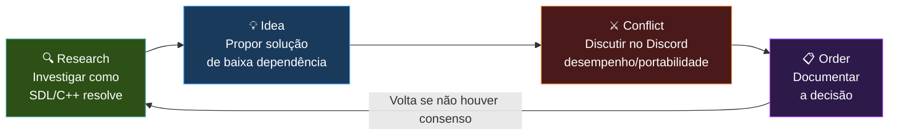

# 📑 Caffeine Planning & Architecture

**Diretório de Design e Especificações Técnicas.**

Este diretório contém os documentos fundamentais que regem o desenvolvimento da **Caffeine Engine**. Antes de escrever qualquer linha de código em `/src`, os Architects e Scribes consultam e atualizam os documentos aqui contidos.

> ⚠️ Para uma visão **completa e consolidada** do projeto, consulte [`MASTER.md`](MASTER.md). Este diretório contém specs **detalhadas** de subsistemas.

---

## 📂 Conteúdo

| Documento | Função | Relação com MASTER.md |
|---|---|---|
| **`MASTER.md`** | Documentação unificada completa | — |
| **`SPECS.md`** *(este)* | Regras e padrões de desenvolvimento | Complemento — MASTER §2, §5, §6 |
| **`ROADMAP.md`** | Status e progresso das 6 fases | Resumo — MASTER §4 |
| **`architecture_specs.md`** | Especificações técnicas do ECS, Job System e RHI | Técnico — MASTER §3 |
| **`memory_model.md`** | Especificações detalhadas dos Custom Allocators | Técnico — MASTER §8 |

### Documentação por Módulo

| Módulo | Arquitetura | API |
|--------|-------------|-----|
| **Core** | [`architecture/core.md`](architecture/core.md) | [`api/README.md`](api/README.md) |
| **Memory** | [`architecture/memory.md`](architecture/memory.md) | [`api/README.md`](api/README.md) |
| **Containers** | [`containers/vector.md`](containers/vector.md) | [`api/README.md`](api/README.md) |
| **Math** | [`math/vectors.md`](math/vectors.md) | [`api/README.md`](api/README.md) |

---

## 🚦 Status das Fases

| Fase | Descrição | Status | Próximo Marcos |
| :--- | :--- | :--- | :--- |
| **0** | **Setup Inicial & Docs** | 🕒 Em Progresso | `Caffeine.h` criado, CMake base |
| **1** | **Fundação Atômica (Memória/Tipos)** | 📅 Planejado | Stress test de allocators |
| **2** | **Concorrência & Loop** | 📅 Planejado | Demo 10K partículas, tsan clean |
| **3** | **RHI & 2D Foundation** | 📅 Planejado | Demo 50K sprites 60fps |
| **4** | **ECS & Serialização** | 📅 Planejado | 100 entidades dinâmicas |
| **5** | **Transição 3D** | 📅 Planejado | Mesh + shader customizado |
| **6** | **Caffeine Studio IDE** | 📅 Planejado | Primeiro game completo |

---

## 🛠️ Fluxo de Planejamento

Seguimos o ciclo **R.I.C.O.** (Research, Idea, Conflict, Order):

### Detalhamento

| Etapa | Ação | Responsável |
|---|---|---|
| **Research** | Investigar como SDL3 ou C++ lidam com o problema | Architect / Scribe |
| **Idea** | Propor solução que se encaixe na filosofia de baixa dependência | Architect |
| **Conflict** | Discutir no Discord — a solução fere desempenho ou portabilidade 3D? | Full Guild |
| **Order** | Documentar a decisão final **neste diretório** + criar issue | Architect |

---

## ⚖️ Regras de Ouro

1. **Mantenha Simples:** Se a explicação de um sistema for mais complexa que o código, o sistema precisa ser simplificado.
2. **Agnosticismo Dimensional:** Toda spec escrita aqui deve prever que o dado pode ser 2D ou 3D.
3. **Sincronia:** Se o código mudar drasticamente, o documento de planejamento correspondente **deve** ser atualizado no **mesmo Commit**.
4. **Performance Budget:** Nova funcionalidade não pode degradar o FPS do boilerplate em mais de **1%**.
5. **Modularidade:** Deve ser possível compilar a engine sem um módulo (ex: áudio) sem quebrar outros.

---

## 🔄 Ciclo de Feedback

Todo subsistema passa por este ciclo antes de ser integrado:

---

## 📌 Checklist de Documentação

Antes de abrir PR para código novo:

- [ ] Spec correspondente existe em `docs/faseN/` (ex: `docs/fase2/job-system.md`)
- [ ] Código e documentação estão no **mesmo commit**
- [ ] Nomenclatura segue `SPECS.md §Convenções`
- [ ] Stress test foi executado para o módulo
- [ ] Allocators foram usados (nenhum `new`/`delete` solto)

---

## See Also

- [MASTER.md](MASTER.md) - Documentação unificada completa
- [ROADMAP.md](ROADMAP.md) - Roadmap completo
- [architecture_specs.md](architecture_specs.md) - Especificações técnicas
- [memory_model.md](memory_model.md) - Modelo de memória

> *Planejar é trazer o futuro para o presente, para que possamos fazer algo a respeito agora.*