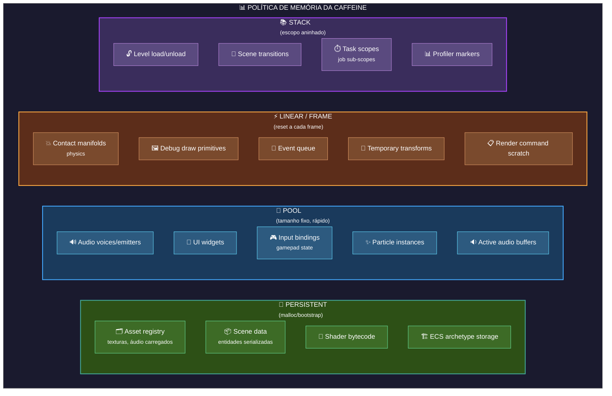
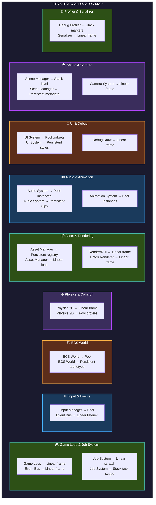

# 🧠 Memory Model — Especificação de Allocators

> ⚠️ **Status:** Revisado contra o código em 2026-09-21.  
> Seções A–B.1–B.3 e F descrevem código real (`src/memory/`).  
> **ProxyAllocator (§B.4) e AllocatorRegistry (§C) NÃO existem no código** —
> estão marcados como planejados.  
> Para contexto completo, consulte [`../MASTER.md`](../MASTER.md) e
> [`../architecture_specs.md`](../architecture_specs.md).

Este documento contém as **especificações técnicas detalhadas** dos sistemas de gerenciamento de memória da Caffeine Engine.

---

## 📋 Índice

| Allocator | Fase | Status | Uso |
|---|---|---|---|
| **IAllocator (Interface)** | 1 | ✅ Completo | Base para todos os allocators |
| **Linear Allocator** | 1 | ✅ Completo | Scratch space por frame |
| **Pool Allocator** | 1 | ✅ Completo | Blocos de tamanho fixo |
| **Stack Allocator** | 1 | ✅ Completo | Escopos aninhados |
| **Proxy Allocator** | 1 | 📅 Planejado | Wrappers com logging/debug |
| **TLSF Allocator** | TBD | 💡 Ideia | Fallback para alocações gerais |
| **Buddy Allocator** | TBD | 💡 Ideia | Para o sistema de levels |

---

## A. Visão Geral — Política de Memória

### A.1 The Golden Rule

```
╔════════════════════════════════════════════════════════════════╗
║  REGRA: hot paths da engine usam Custom Allocators.         ║
║  Toda alocação de sistema deve aceitar IAllocator*.           ║
╚════════════════════════════════════════════════════════════════╝
```

> Realidade verificada: a regra vale para o núcleo (ECS `World`/`Archetype`/
> `CommandBuffer`, `AssetManager` com `LinearAllocator` próprio, `BlobLoader`,
> `Vector<T>` com `IAllocator*` opcional). `Vector` sem allocator usa
> `new`/`delete` global, os próprios allocators alocam o buffer inicial com
> `new u8[]`, e subsistemas de ferramenta/editor usam STL livremente. Ou seja:
> a política é "allocator injetável nos sistemas", não "zero `new` no repositório".

### A.2 Mapa de Allocators por Uso (política-alvo)

> ⚠️ O diagrama abaixo é a **política desejada**, não o uso verificado.
> O uso real confirmado em código está na tabela "Uso real verificado" logo após.



### A.2b Uso real verificado (código, 2026-09-21)

| Sistema | Uso real | Arquivo |
|---|---|---|
| **ECS** | `World`, `Archetype`/`ComponentPool`, `CommandBuffer` aceitam `IAllocator*` (opcional, pode ser `nullptr`) | `src/ecs/World.hpp`, `Archetype.hpp`, `CommandBuffer.hpp` |
| **Assets** | `AssetManager` possui `LinearAllocator` próprio (arena por asset) | `src/assets/AssetManager.hpp` |
| **IO** | `BlobLoader::load(path, IAllocator*)` carrega binários no allocator dado | `src/core/io/BlobLoader.hpp` |
| **Containers** | `Vector<T>` aceita `IAllocator*`; sem allocator usa `new`/`delete` global | `src/containers/Vector.hpp` |
| **Testes/bench** | `tests/test_allocators.cpp`, `BENCHMARK`s em `tests/benchmarks.cpp` | `tests/` |

Physics, EventBus, Render, JobSystem, Audio, UI e Debug **não** usam estes
allocators hoje (usam std/malloc) — a migração para o mapa-alvo acima está pendente.

### A.3 Interface Base

> Namespace real: `Caffeine` (não `Caffeine::Memory`).

```cpp
namespace Caffeine {

// ============================================================================
// @brief  Interface base para todos os allocators.
//
//  Todos os allocators da Caffeine implementam esta interface.
//  Isso permite trocar allocators em runtime e usar patterns como
//  ProxyAllocator para debug.
// ============================================================================
class IAllocator {
public:
    virtual ~IAllocator() = default;

    // -----------------------------------------------------------------------
    // @brief  Aloca memória alinhada.
    // @param  size      Tamanho em bytes.
    // @param  alignment Alinhamento (deve ser potência de 2).
    // @return Ponteiro para a memória alocada ou nullptr se falhou.
    // -----------------------------------------------------------------------
    virtual void* alloc(usize size, usize alignment = 8) = 0;

    // -----------------------------------------------------------------------
    // @brief  Libera memória alocada.
    // @note   Para Linear e Stack, free() pode não fazer nada (reset limpa tudo).
    // -----------------------------------------------------------------------
    virtual void free(void* ptr) = 0;

    // -----------------------------------------------------------------------
    // @brief  Para Linear/Stack: volta ao início.
    //          Para Pool: não faz nada.
    // -----------------------------------------------------------------------
    virtual void reset() = 0;

    // -----------------------------------------------------------------------
    // @brief  Retorna a memória atualmente em uso (bytes).
    // -----------------------------------------------------------------------
    virtual usize usedMemory() const = 0;

    // -----------------------------------------------------------------------
    // @brief  Retorna a memória total alocada pelo allocator (bytes).
    // -----------------------------------------------------------------------
    virtual usize totalSize() const = 0;

    // -----------------------------------------------------------------------
    // @brief  Retorna o pico de memória já usado (bytes).
    // -----------------------------------------------------------------------
    virtual usize peakMemory() const = 0;

    // -----------------------------------------------------------------------
    // @brief  Retorna o número de alocações feitas.
    // -----------------------------------------------------------------------
    virtual usize allocationCount() const = 0;

    // -----------------------------------------------------------------------
    // @brief  Retorna o nome do allocator (para debugging).
    // -----------------------------------------------------------------------
    virtual const char* name() const = 0;
};

// Helpers livres (Allocator.hpp)
inline usize calculatePadding(void* ptr, usize alignment);
inline usize calculateAlignedSize(usize size, usize alignment);

}  // namespace Caffeine
```

---

## B. Allocators Detalhados

---

## 1. Linear Allocator

**Fase:** 1

### Propósito

| Quando usar | Quando NÃO usar |
|---|---|
| Memória volátil por frame | Persistência entre frames |
| Scratch space para cálculos | Alocações de tamanho variável que precisam de free individual |
| Buffers temporários (contact manifolds, events) | Alocações que sobrevivem ao escopo |

### Interface

```cpp
namespace Caffeine {

// ============================================================================
// @brief  Allocator linear — aloca do início ao fim, reset limpa tudo.
//
//  Algoritmo:
//
//  ┌─────────────────────────────────────────────────────────────┐
//  │  [ Usado │............. Livre ...................] [ Fim ]   │
//  │          ▲                                          ▲      │
//  │        m_cursor                                    m_end  │
//  └─────────────────────────────────────────────────────────────┘
//
//  alloc() avança m_cursor e retorna ponteiro.
//  reset() volta m_cursor para m_start.
//
//  Performance: O(1) para todas as operações.
//
//  Thread Safety: NÃO thread-safe. Usar apenas na main thread.
// ============================================================================
class LinearAllocator final : public IAllocator {
public:
    // -----------------------------------------------------------------------
    // @brief  Constrói com um buffer pré-alocado.
    // @param  buffer  Ponteiro para o buffer (ownership não é transferido).
    // @param  size    Tamanho do buffer em bytes.
    // @note   O buffer deve permanecer válido durante a vida do allocator.
    // -----------------------------------------------------------------------
    LinearAllocator(void* buffer, usize size);

    // -----------------------------------------------------------------------
    // @brief  Constrói e aloca buffer internamente (via new u8[]).
    // -----------------------------------------------------------------------
    explicit LinearAllocator(usize size);

    ~LinearAllocator() override;

    void* alloc(usize size, usize alignment = 8) override;
    void  free(void* ptr) override;   // No-op (reset limpa tudo)
    void  reset() override;           // Volta ao início (zera allocCount)

    usize usedMemory()   const override { return m_cursor - m_start; }
    usize totalSize()    const override { return m_end - m_start; }
    usize peakMemory()   const override { return m_peak; }
    usize allocationCount() const override { return m_allocCount; }
    const char* name()    const override { return "Linear"; }

    // -----------------------------------------------------------------------
    // @brief  Retorna a memória livre disponível.
    // -----------------------------------------------------------------------
    usize availableMemory() const { return m_end - m_cursor; }

    // -----------------------------------------------------------------------
    // @brief  Retorna o cursor atual (para debugging).
    // -----------------------------------------------------------------------
    void* currentPointer() const { return m_cursor; }

private:
    u8*  m_start;
    u8*  m_end;
    u8*  m_cursor;
    usize m_peak = 0;
    usize m_allocCount = 0;
    bool  m_ownsBuffer = false;
};

}  // namespace Caffeine
```

### Implementação

```cpp
void* LinearAllocator::alloc(usize size, usize alignment) {
    // Align up cursor
    usize padding = calculatePadding(m_cursor, alignment);
    usize totalSize = size + padding;

    // Check overflow
    if (m_cursor + totalSize > m_end) {
        return nullptr;  // Out of memory
    }

    void* ptr = m_cursor + padding;
    m_cursor += totalSize;

    // Track stats
    usize used = usedMemory();
    if (used > m_peak) m_peak = used;
    ++m_allocCount;

    return ptr;
}
```

### Uso por Sistema (alvo — ver §A.2b para o uso real atual)

| Sistema | Uso | Tamanho típico |
|---|---|---|
| **Physics** | Contact manifolds, collision pairs | 64KB - 256KB |
| **Events** | Event queue temporário | 32KB |
| **Debug Draw** | Primitive lists | 128KB |
| **Render** | Vertex buffer staging | 1MB |
| **Job System** | Task scratch memory | 64KB por worker |

---

## 2. Pool Allocator

**Fase:** 1

### Propósito

| Quando usar | Quando NÃO usar |
|---|---|
| Objetos de tamanho fixo | Tamanhos variáveis |
| Alocações/desalocações frequentes | Dados que precisam sobreviver ao reset |
| Emitters, particles, audio voices | Assets carregados |

### Interface

```cpp
namespace Caffeine {

// ============================================================================
// @brief  Pool Allocator — aloca blocos de tamanho fixo.
//
//  Algoritmo:
//
//  ┌─────────────────────────────────────────────────────────────┐
//  │  Slot[0] │ Slot[1] │ Slot[2] │ ... │ Slot[N-1]          │
//  │    ●      │    ○    │    ●    │     │    ○               │
//  │  (usado)  │ (livre) │ (usado) │     │   (livre)         │
//  └─────────────────────────────────────────────────────────────┘
//       ▲
//     m_freeList ──── free list intrusiva (cada slot livre guarda
//                     o ponteiro do próximo; slot mínimo: 8 bytes)
//
//  Performance: O(1) para alloc e free.
//  Thread Safety: NÃO thread-safe. Usar TLS se necessário.
// ============================================================================
class PoolAllocator final : public IAllocator {
public:
    // -----------------------------------------------------------------------
    // @brief  Constrói com buffer e tamanho de slot.
    // @param  buffer    Ponteiro para o buffer (sem ownership).
    // @param  poolSize  Tamanho total do buffer.
    // @param  slotSize  Tamanho de cada slot (mínimo 8 bytes).
    // @param  alignment Alinhamento (padrão 8; exige >= 8 e potência de 2,
    //         verificado com CF_ASSERT no construtor).
    // -----------------------------------------------------------------------
    PoolAllocator(void* buffer, usize poolSize, usize slotSize,
                  usize alignment = 8);

    // -----------------------------------------------------------------------
    // @brief  Constrói e aloca buffer internamente (via new u8[]).
    // -----------------------------------------------------------------------
    explicit PoolAllocator(usize poolSize, usize slotSize, usize alignment = 8);
    ~PoolAllocator() override;

    // @note  alloc() IGNORA size/alignment e retorna sempre 1 slot fixo.
    //        Em debug, CF_ASSERT(size <= m_slotSize). Retorna nullptr se
    //        o pool estiver exausto.
    void* alloc(usize size, usize alignment = 8) override;
    // @note  free(nullptr) é seguro (no-op). NÃO há detecção de double-free:
    //        liberar 2x o mesmo slot corrompe silenciosamente a free list.
    void  free(void* ptr) override;
    void  reset() override;  // Reconstrói a free list, zera usados

    usize usedMemory()    const override { return m_usedCount * m_slotSize; }
    usize totalSize()     const override { return m_poolSize; }
    usize peakMemory()   const override { return m_peakSlots * m_slotSize; }
    usize allocationCount() const override { return m_usedCount; }
    const char* name()    const override { return "Pool"; }

    // -----------------------------------------------------------------------
    // @brief  Retorna quantos slots estão livres.
    // -----------------------------------------------------------------------
    usize freeSlots() const { return m_maxSlots - m_usedCount; }

    // -----------------------------------------------------------------------
    // @brief  Retorna o tamanho de cada slot.
    // -----------------------------------------------------------------------
    usize slotSize() const { return m_slotSize; }

    // -----------------------------------------------------------------------
    // @brief  Retorna o número máximo de slots (poolSize / slotSize).
    // -----------------------------------------------------------------------
    usize maxSlots() const { return m_maxSlots; }

private:
    void initializeFreeList();  // Reconstrói a free list (usado no ctor/reset)

    u8*    m_freeList = nullptr;
    u8*    m_poolStart = nullptr;
    usize  m_poolSize = 0;
    usize  m_slotSize = 0;
    usize  m_alignment = 8;
    usize  m_maxSlots = 0;
    usize  m_usedCount = 0;
    usize  m_peakSlots = 0;
    bool   m_ownsBuffer = false;
};

}  // namespace Caffeine
```

### Implementação

```cpp
void* PoolAllocator::alloc(usize size, usize alignment) {
    // Pool allocator ignora size — usa slotSize fixo
    CF_ASSERT(size <= m_slotSize, "Requested size exceeds slot size");

    if (!m_freeList) {
        return nullptr;  // Pool exausto
    }

    void* ptr = m_freeList;
    m_freeList = *static_cast<void**>(ptr);  // Pop do free list
    ++m_usedCount;
    if (m_usedCount > m_peakSlots) m_peakSlots = m_usedCount;

    return ptr;
}

void PoolAllocator::free(void* ptr) {
    if (!ptr) return;

    // Push para o free list
    *static_cast<void**>(ptr) = m_freeList;
    m_freeList = ptr;
    --m_usedCount;
}
```

### Uso por Sistema (alvo — ver §A.2b para o uso real atual)

| Sistema | Uso | Tamanho de slot |
|---|---|---|
| **Audio** | AudioSource/voice instances | 128 bytes |
| **Particles** | Particle instances | 64 bytes |
| **UI** | Widget instances | 256 bytes |
| **ECS** | Component arrays (internal) | varies |
| **Input** | Gamepad state records | 64 bytes |

---

## 3. Stack Allocator

**Fase:** 1

### Propósito

| Quando usar | Quando NÃO usar |
|---|---|
| Escopos aninhados (levels) | Persistência entre resets |
| Frames com alocações que precisam de free ordenado | Free fora de ordem |
| Temporary task scopes | Alocações de threads diferentes |

### Interface

```cpp
namespace Caffeine {

// Marker = offset em bytes a partir do início do buffer (usize, não ponteiro).
using Marker = usize;

// ============================================================================
// @brief  Stack Allocator — aloca em pilha com marcadores.
//
//  Algoritmo:
//
//  1. Allocate: avança cursor como LinearAllocator
//  2. SetMarker: salva posição atual (offset)
//  3. FreeToMarker: libera tudo após o marker
//
//  ┌─────────────────────────────────────────────────────────────┐
//  │  [ Usado A ] │ [ Marker ] │ [ Usado B ] │.....│ Livre   │
//  │                          ▲           ▲                    │
//  │                       marker1      cursor                │
//  │                                                           │
//  │  freeToMarker(marker1) ───▶ libera [Usado B]           │
//  └───────────────────────────────────────────────────────────┘
//
//  Performance: O(1) para todas as operações.
//  Thread Safety: NÃO thread-safe.
// ============================================================================
class StackAllocator final : public IAllocator {
public:
    StackAllocator(void* buffer, usize size);
    explicit StackAllocator(usize size);
    ~StackAllocator() override;

    void* alloc(usize size, usize alignment = 8) override;
    void  free(void* ptr) override;  // No-op total (ignora ptr)
    void  reset() override;

    // -----------------------------------------------------------------------
    // @brief  Salva um marcador (offset atual).
    // -----------------------------------------------------------------------
    Marker setMarker();

    // -----------------------------------------------------------------------
    // @brief  Libera tudo após o marcador. Markers além do cursor são
    //         ignorados (guard). Zera allocationCount.
    // -----------------------------------------------------------------------
    void freeToMarker(Marker marker);

    usize usedMemory()      const override;
    usize totalSize()       const override { return m_end - m_start; }
    usize peakMemory()      const override { return m_peak; }
    usize allocationCount() const override { return m_allocCount; }
    const char* name()     const override { return "Stack"; }

private:
    u8*  m_start;
    u8*  m_end;
    u8*  m_cursor;
    usize m_peak = 0;
    usize m_allocCount = 0;
    bool  m_ownsBuffer = false;
};

}  // namespace Caffeine
```

### Uso por Sistema (alvo — ver §A.2b para o uso real atual)

| Sistema | Uso | Tamanho típico |
|---|---|---|
| **Scene** | Level load/unload | 1MB - 16MB |
| **Job System** | Task sub-scopes | 64KB por worker |
| **Profiler** | Markers de escopo | 4KB |
| **Asset Manager** | Asset loading arena | 8MB |

---

## 4. Proxy Allocator

> ❌ **NÃO IMPLEMENTADO** — seção de especificação futura. Não existe
> `ProxyAllocator` em `src/memory/` (apenas `Allocator`, `Linear`, `Pool`,
> `Stack`). Mantido aqui como intenção de design.

**Fase:** 1 (planejado)

### Propósito (planejado)

Wrapper que adiciona logging, debugging ou accounting a qualquer allocator
existente. Útil para debugging de memory leaks e profiling de alocações.
Interface prevista: `ProxyAllocator(IAllocator* backend, const char* name)`
com relatório `AllocationReport` (uso atual, pico, total de allocs/frees/falhas)
e header de tracking por alocação.

---

## C. Allocator Registry

> ❌ **NÃO IMPLEMENTADO** — não existe `AllocatorRegistry` no código.
> Mantido como intenção de design.

**Fase:** 1 (planejado)

### Visão Geral (planejada)

Para debugging e profiling, todo allocator seria registrado em um registry
global, permitindo verificar memory leaks no shutdown, profiling de uso e
detecção de fragmentação (`registerAllocator` / `unregisterAllocator` /
`globalStats` / `printReport` / `hasLeaks`).

### Exemplo de Saída (formato desejado, não gerado hoje)

```
=== Memory Report ===
[Linear]  Physics Scratch:   64.0 KB /  256.0 KB (used/peak)
[Pool]    Audio Voices:       16.0 KB /   32.0 KB (32 slots, 16 used)
[Pool]    UI Widgets:          8.0 KB /   16.0 KB (64 slots, 8 used)
[Stack]   Level Arena:       512.0 KB / 2048.0 KB (marker at 25%)
[Linear]  Render Staging:    64.0 KB / 1024.0 KB (used/peak)

Total: 664.0 KB used, 3.3 MB peak, 1.2M allocs
```

---

## D. Uso por Sistema — Mapa Completo (política-alvo)

> ⚠️ Mapa desejado, não uso verificado — ver §A.2b.



---

## E. Benchmarks de Referência

> ⚠️ Metas de projeto **não medidas** — `tests/benchmarks.cpp` contém apenas
> `BENCHMARK`s básicos de Linear/Pool sem números-alvo assertados. Os valores
> abaixo são estimativas, não resultados.

### E.1 Linear Allocator

| Métrica | Valor |
|---|---|
| `alloc()` throughput | ~50M allocs/segundo |
| `reset()` throughput | ~500M resets/segundo |
| Fragmentação | 0% (reset limpa tudo) |
| Overhead por alloc | ~0 bytes |

### E.2 Pool Allocator

| Métrica | Valor |
|---|---|
| `alloc()` throughput | ~30M allocs/segundo |
| `free()` throughput | ~40M frees/segundo |
| Fragmentação | 0% (slots fixos) |
| Overhead por slot | 0 bytes (free list intrusiva usa o próprio slot livre) |
| Max slots | `poolSize / slotSize` (sem teto fixo no código) |

### E.3 Stack Allocator

| Métrica | Valor |
|---|---|
| `alloc()` throughput | ~50M allocs/segundo |
| `freeToMarker()` throughput | ~100M frees/segundo |
| Fragmentação | 0% (free to marker) |
| Max markers por stack | Ilimitado (marker = offset, sem tabela) |

---

## F. Checklist de Integração

Antes de usar um allocator em um novo sistema:

- [ ] Sistema usa `IAllocator*` como parâmetro (não hardcoded)
- [ ] Sistema reseta allocators lineares no início de cada frame
- [ ] Sistema usa Pool para objetos de tamanho fixo
- [ ] Sistema usa Stack para escopos aninhados
- [ ] Sistema verifica `alloc()` retornou `nullptr` (out-of-memory)
- [ ] Sistema NÃO guarda ponteiros após `reset()` ou `freeToMarker()`
- [ ] (Futuro) Sistema loga estatísticas via AllocatorRegistry — ainda não existe (§C)
