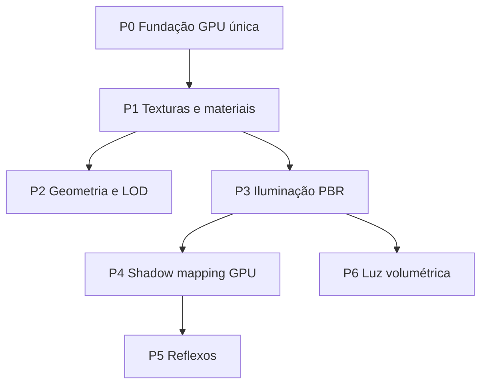

# 🎨 Rendering Roadmap — 3D de Alto Volume

> **Objetivo:** renderizar ambientes 3D com alto volume de polígonos e texturas de forma **otimizada, consistente e estável** (sem spikes de FPS).  
> **Critério de “completo”:** cena densa (terreno + centenas de meshes texturizados + iluminação dinâmica + sombras) a 60 FPS estáveis no editor e no runtime.  
> **Estado atual (2026-09-22):** viewport 3D GPU com Phong + CSM + sombras point/spot; runtime GPU-first; `GpuTextureCache` com mips, refcount e **LOD de texturas por distância**; wireframe GPU (`FillMode::Line`); HiDPI com cap 1920px; mesh geometry LOD é stub; batching pendente.

---

## Diagnóstico (causa provável dos FPS spikes)

| Sintoma | Causa raiz | Ficheiros |
|---------|-----------|-----------|
| Spike ao mover câmara | Shadow passes + resolução HiDPI alta | `GpuSceneRenderer.cpp`, `SceneViewport.cpp` |
| Spike ao mover câmara (mitigado) | Skip shadows em movimento rápido; cap resolução 1920px | `SceneViewport.cpp` |
| Terreno pesado | Rebuild mesh / upload GPU síncrono | `TerrainCache.cpp`, `GpuSceneRenderer.cpp` |
| Muitos draw calls | 1 `drawIndexed` por mesh, sem batching | `GpuSceneRenderer.cpp` |
| Sombras inconsistentes | ~~Runtime CPU shadows~~ resolvido; tuning CSM/PCF | `GpuDirectionalShadowMap.*`, `scene_lit.frag` |
| Materiais “flat” | Phong ligado; PBR metallic/roughness pendente | `scene_lit.frag`, `terrain_lit.frag` |

---

## Fases e dependências

Cada fase tem entregável testável. **Não avançar** para reflexos/volumétricos antes de P4 estável.

---

## P0 — Fundação: um único caminho GPU

**Meta:** eliminar dual-path (CPU raster + GPU) no viewport 3D.

| Tarefa | Descrição | Ficheiros |
|--------|-----------|-----------|
| P0.1 | GPU como default para **todos** os meshes texturizados | `SceneViewport.cpp`, `GpuSceneRenderer.cpp` |
| P0.2 | Remover fallback CPU exceto wireframe/debug | `SceneViewport.cpp` | ✅ (GPU texturizado + wireframe `FillMode::Line`) |
| P0.3 | Upload de buffers **antes** do render pass (já parcial) | `GpuSceneRenderer.cpp` |
| P0.4 | Runtime play mode usar `GpuSceneRenderer` (hoje CPU-only) | `RuntimeSceneRenderer.cpp` | ✅ |
| P0.5 | Profiler markers por pass (shadow, opaque, terrain, composite) | `Profiler.hpp`, viewport |

**Métrica de sucesso:** viewport 3D sem `MeshCpuRasterizer` em modo shaded; FPS estável ±5% ao orbitar câmara.

**Doc detalhada:** [`rendering/rhi.md`](../rendering/rhi.md) (atualizar após P0)

---

## P1 — Texturas e materiais

**Meta:** cache GPU global, mips, sem reload por frame.

| Tarefa | Descrição | Ficheiros |
|--------|-----------|-----------|
| P1.1 | `GpuTextureCache` central (path → `GPUTexture`, refcount) | `src/render/GpuTextureCache.*` | ✅ |
| P1.2 | Geração de mipmaps no upload | `GpuTextureCache.cpp`, `RenderDevice.cpp` | ✅ |
| P1.3 | Bind albedo + normal + ORM no `scene_lit` | `scene_lit.frag`, `MeshComponents.hpp` | ✅ albedo + normal + shininess |
| P1.4 | Async decode (job system) + upload no frame N+1 | `JobSystem`, `AssetManager` |
| P1.5 | Atlas opcional para props repetidos (instancing) | `TextureAtlas.hpp` (estender) |
| P1.6 | LOD de texturas por distância aos visualizadores (tiers em cache) | `TextureQuality.hpp`, `GpuTextureCache.*` | ✅ |

**Métrica:** 0 `stbi_load` durante render loop; memória GPU estável após warm-up.

**Doc:** [`assets/asset-manager.md`](../assets/asset-manager.md), [`rendering/texture-quality-lod.md`](../rendering/texture-quality-lod.md), nova `docs/rendering/materials-pbr.md`

---

## P2 — Polígonos, meshes e LOD

**Meta:** cenas com 500k–2M triângulos visíveis com culling agressivo.

| Tarefa | Descrição | Ficheiros |
|--------|-----------|-----------|
| P2.1 | Mesh LOD real (simplificação ou LOD chains no import) | `MeshLOD.cpp`, pipeline `.caf` |
| P2.2 | Seleção LOD por distância + hysteresis (como terreno) | `GpuSceneRenderer.cpp` |
| P2.3 | Frustum + occlusion coarse (octree já existe) | `GpuSceneRenderer.cpp` |
| P2.4 | Instancing para meshes repetidos (árvores, props) | novo pass instanced |
| P2.5 | Terreno: collision mesh separado (feito); GPU chunks estáveis | `TerrainLodSystem.*` |

**Métrica:** draw calls < 200 para cena de referência; triângulos visíveis escalam com LOD.

**Doc:** nova `docs/rendering/mesh-lod.md`

---

## P3 — Iluminação

**Meta:** PBR forward+ (Cook-Torrance) com múltiplas luzes.

| Tarefa | Descrição | Ficheiros |
|--------|-----------|-----------|
| P3.1 | UBO de luzes unificado (dir/point/spot, até N luzes) | `LightingSystem.*`, shaders |
| P3.2 | PBR: metallic/roughness, Fresnel, GGX | `scene_lit.frag` |
| P3.3 | IBL básico (cubemap skybox como ambiente) | `SkyboxRenderer`, shader |
| P3.4 | Tone mapping (ACES) + exposure | shader + `PostProcess` GPU futuro |
| P3.5 | Spot lights no GPU (hoje só CPU) | `scene_lit.frag` | ✅ |

**Métrica:** esfera de referência + terreno com resposta física plausível; sem banding em gradientes.

**Doc:** atualizar [`rendering/camera-3d.md`](../rendering/camera-3d.md)

---

## P4 — Shadow mapping (GPU)

**Meta:** sombras direcionais + spot estáveis; point opcional (cubemap).

| Tarefa | Descrição | Ficheiros |
|--------|-----------|-----------|
| P4.1 | Ligar `renderDirectionalShadows` em `renderWithCamera` | `GpuSceneRenderer.cpp` | ✅ |
| P4.2 | CSM 2–4 cascatas para sol | `GpuDirectionalShadowMap.*` | ✅ |
| P4.3 | PCF / PCSS no `scene_lit.frag` | shaders | ✅ PCF 3×3 |
| P4.4 | Terreno `castShadows` no gather GPU | `GpuSceneRenderer.cpp` | ✅ |
| P4.5 | Spot shadow maps (1–2 luzes) | `GpuSpotShadowMap.*` | ✅ |
| P4.6 | Desligar CPU shadow path no editor quando GPU OK | `SceneViewport.cpp` | ✅ |
| P4.7 | Point light cubemap shadows (até 2) | `GpuPointShadowMap.*` | ✅ |

**Infra ligada:** `GpuDirectionalShadowMap`, `GpuPointShadowMap`, `shadow_depth.*` — ver [`rendering/shadow-mapping.md`](../rendering/shadow-mapping.md)

**Métrica:** sombras sem acne/ peter-panning visível; custo < 3 ms @ 1080p.

**Doc:** [`rendering/shadow-mapping.md`](../rendering/shadow-mapping.md), [`rendering/materials-phong.md`](../rendering/materials-phong.md)

---

## P5 — Reflexos em tempo real

**Meta:** reflexos convincentes sem custo proibitivo.

| Abordagem | Quando | Custo |
|-----------|--------|-------|
| **Planar** (espelhos, água plana) | P5.1 | Baixo |
| **SSR** (screen-space) | P5.2 | Médio |
| **Reflection probes** (cubemap local) | P5.3 | Médio |
| **RT reflections** | futuro | Alto |

| Tarefa | Descrição |
|--------|-----------|
| P5.1 | Pass de reflexão planar + clip plane |
| P5.2 | SSR com depth + normal buffer (exige G-buffer parcial) |
| P5.3 | Probes automáticos em interiores |

**Pré-requisito:** P4 + depth prepass ou G-buffer mínimo.

**Doc:** nova `docs/rendering/reflections.md`

---

## P6 — Luz volumétrica

**Meta:** god rays, fog volumétrico, shafts de luz direcional.

| Tarefa | Descrição |
|--------|-----------|
| P6.1 | Ray marching fullscreen (luz dir + depth) |
| P6.2 | Froxel grid ou 3D texture para fog local |
| P6.3 | Integração com sombras (sample shadow map no march) |

**Nota:** `PostProcessRenderer` atual é overlay ImGui — não conta como volumétrico GPU.

**Doc:** nova `docs/rendering/volumetric-lighting.md`

---

## Cena de referência (benchmark interno)

Criar `assets/benchmarks/dense_outdoor.caf`:

- Terreno 512² com splat (plugin)
- 200–500 meshes instanciados (árvores/rochas)
- 1 direcional + 2 point + 1 spot
- Câmara orbit com medição de frame time (p50, p95, p99)

**Gate de qualidade:** p95 frame time < 16.6 ms @ 1080p antes de marcar fase como done.

---

## Ordem de execução recomendada

1. **P0** (esta semana) — maior impacto nos spikes
2. **P1** — texturas são o suspeito #1 dos spikes atuais
3. **P2** — polígonos sem LOD matam GPU e CPU
4. **P4** — sombras GPU (infra já existe)
5. **P3** — PBR em cima de base estável
6. **P5 / P6** — polish visual avançado

---

## Links

| Documento | Conteúdo |
|-----------|----------|
| [`rendering/rhi.md`](../rendering/rhi.md) | Abstração SDL_GPU |
| [`rendering/batch-renderer.md`](../rendering/batch-renderer.md) | Sprites 2D (não 3D) |
| [`terrain/terrain-system.md`](../terrain/terrain-system.md) | Terreno LOD/chunks |
| [`plans/2026-05-23-3d-mesh-enhancements.md`](2026-05-23-3d-mesh-enhancements.md) | Plano anterior meshes |
| [`plans/2026-09-22-viewport-rendering-quality-session.md`](2026-09-22-viewport-rendering-quality-session.md) | Sessão viewport: HiDPI, wireframe GPU, LOD texturas |
| [`rendering/texture-quality-lod.md`](../rendering/texture-quality-lod.md) | LOD de texturas por distância |
| [`editor/scene-viewport.md`](../editor/scene-viewport.md) | Pipeline do Scene Viewport 3D |
