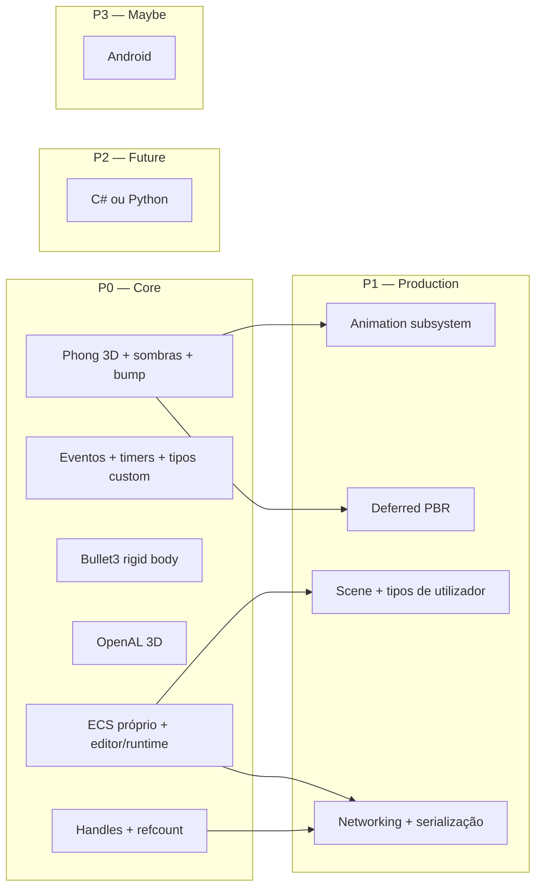
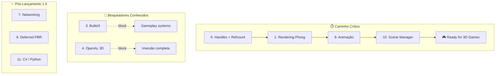

# 🏛️ Engine Pillars — Roadmap de Sistemas Fundamentais

> **Objetivo:** definir de forma **sólida e verificável** os subsistemas que a Caffeine Engine deve ter como base de produção — independentemente de features de editor ou plugins.  
> **Critério de “completo”:** cada pilar tem requisitos, critérios de aceitação e estado atual documentados.  
> **Última atualização:** 2026-09-22

Este documento complementa:
- [`2026-09-21-rendering-roadmap.md`](2026-09-21-rendering-roadmap.md) — detalhe técnico de rendering 3D
- [`../HISTORY.md`](../HISTORY.md) — fases históricas de desenvolvimento
- [`../../planning/caffeine-studio-ide.md`](../../planning/caffeine-studio-ide.md) — milestones do Doppio (IDE)

---

## Prioridades

| Tier | Significado |
|------|-------------|
| **P0 — Core** | Fundação obrigatória para jogos 3D sérios. Sem isto a engine não é “production-ready”. |
| **P1 — Production** | Necessário para títulos completos (multiplayer, animação rica, serialização avançada). |
| **P2 — Future** | Planeado, mas não bloqueia o primeiro release 3D. |
| **P3 — Maybe** | Desejável; depende de recursos e validação de mercado. |

---

## P0 — Core

### 1. Rendering 3D Phong (sombras dinâmicas, bump mapping, câmaras)

**Estado:** 🟡 Parcial — Phong GPU + CSM (4 cascatas) + sombras point/spot GPU; normal maps mesh+terreno; runtime GPU-first; `GpuTextureCache` com mips e **LOD de texturas por distância**; viewport HiDPI (cap 1920px), wireframe GPU (`FillMode::Line`), skip shadows em movimento rápido; CPU shadows off no viewport GPU. Falta: mesh geometry LOD/batching, 60 FPS gate.

**Deve ter de forma sólida:**

| Requisito | Critério de aceitação |
|-----------|----------------------|
| Iluminação Phong (ambient + diffuse + specular) | Materiais com `shininess`, luzes direcionais/pontuais estáveis a 60 FPS |
| Sombras dinâmicas | Shadow mapping GPU direcional CSM (2) + point cubemap (2) + spot (2); sem fallback CPU no viewport GPU |
| Bump / normal mapping | Normal maps em meshes (TBN) e terreno (triplanar); tangentes no vertex buffer |
| Sistema de câmaras 3D | Componente `Camera3D` + follow/orbit/FPS; editor e runtime partilham a mesma API |
| Pipeline único GPU | Sem dual-path CPU raster no viewport shaded (ver rendering roadmap P0) |

**Dependências:** RHI, mesh loading, materiais, `Camera3DComponent`.

**Relação com PBR:** Phong é o **degrau imediato** (P0 rendering). O deferred PBR (P1) evolui sobre a mesma infraestrutura de G-buffer, shadow maps e materiais — não substitui o trabalho de câmaras, sombras e normal mapping.

**Docs:** [`rendering/materials-phong.md`](../rendering/materials-phong.md), [`rendering/shadow-mapping.md`](../rendering/shadow-mapping.md), [`rendering/texture-quality-lod.md`](../rendering/texture-quality-lod.md), [`editor/scene-viewport.md`](../editor/scene-viewport.md), [`2026-09-21-rendering-roadmap.md`](2026-09-21-rendering-roadmap.md), [`2026-09-22-phong-gpu-handles-session.md`](2026-09-22-phong-gpu-handles-session.md), [`2026-09-22-viewport-rendering-quality-session.md`](2026-09-22-viewport-rendering-quality-session.md)

---

### 2. Sistema de eventos (timers + tipos customizados)

**Estado:** 🟡 Parcial — `EventBus` tipado + `TimerScheduler` (`scheduleOnce` / `scheduleRepeating` no fixed timestep). Tipos custom runtime e thread-safety doc ainda limitados.

**Deve ter de forma sólida:**

| Requisito | Critério de aceitação |
|-----------|----------------------|
| Pub/sub tipado | `subscribe<T>` / `publish<T>` com handles canceláveis |
| Eventos diferidos | Fila processada em `dispatch()` no game loop |
| **Timers** | `scheduleOnce`, `scheduleRepeating`, cancelamento por handle; integração com fixed timestep |
| **Tipos custom** | API para registar novos tipos de evento (ID estável ou RTTI controlado) sem recompilar o core |
| Thread-safety documentada | Regras claras: o quê pode ser chamado de jobs vs main thread |

**Dependências:** Game loop, `EventBus`.

**Docs:** [`core/events.md`](../core/events.md), [`core/timer.md`](../core/timer.md)

---

### 3. Física rigid body (Bullet3)

**Estado:** 🔴 Não iniciado (3D) — Physics 2D custom existe; menções a Jolt/Bullet em planning apenas.

**Deve ter de forma sólida:**

| Requisito | Critério de aceitação |
|-----------|----------------------|
| Integração **Bullet3** | `btDiscreteDynamicsWorld`, shapes (box, sphere, capsule, mesh convex), rigid bodies |
| ECS bridge | `RigidBody3D`, `Collider3D`, sync transform ↔ physics (editor + play mode) |
| Terreno | Heightfield ou mesh collision para terreno sculptado |
| Debug draw | Wireframes de colliders no viewport (toggle) |
| Determinismo razoável | Fixed step; documentar limitações cross-platform |

**Dependências:** ECS, math, terreno collision mesh (`TerrainCollisionMeshBuilder`).

**Nota:** Bullet3 escolhido explicitamente como backend; abstração `IPhysicsWorld3D` para não acoplar ECS ao Bullet em todo o código.

---

### 4. Áudio 3D (OpenAL)

**Estado:** 🟡 Parcial — áudio 2D/spatial básico; OpenAL não integrado como backend principal.

**Deve ter de forma sólida:**

| Requisito | Critério de aceitação |
|-----------|----------------------|
| Backend **OpenAL** | Contexto, buffers, sources, listener |
| Formatos comuns | WAV, OGG, FLAC (via decoder); MP3 opcional |
| Áudio 3D | Posição/orientação de listener e sources; atenuação e cone |
| ECS | `AudioEmitter3D`, `AudioListener` ligados a `Transform` / `Position3D` |
| Streaming | Música/long-form sem carregar ficheiro inteiro na RAM |

**Dependências:** Asset manager, ECS, game loop.

**Docs:** [`audio/audio-system.md`](../audio/audio-system.md)

---

### 5. ECS próprio, integrado em runtime e editor

**Estado:** 🟢 Avançado — `World` archetype-based, editor Doppio, runtime `caffeine-runtime`, serialização de cena.

**Deve ter de forma sólida:**

| Requisito | Critério de aceitação |
|-----------|----------------------|
| ECS **escrito pela equipa** | Sem dependência de flecs/EnTT em produção |
| Editor ↔ runtime | Mesmos componentes serializáveis; play mode não corrompe cena |
| Command buffer | Create/destroy seguro durante iteração |
| Reflection mínima | Inspector e serializers gerados ou registados por tipo |
| Systems pipeline | Ordem determinística; prioridades documentadas |

**Dependências:** Memory, scene serializer.

**Docs:** [`ecs/README.md`](../ecs/README.md), [`ecs/scene.md`](../ecs/scene.md)

---

### 6. Gestão de recursos com handles e reference counting

**Estado:** 🟡 Parcial — generation counter, refcount RAII (`AssetHandle`), LRU, invalidation callbacks; `GpuTextureCache` GPU com mips. Falta: async decode→upload N+1, `.caf` checksum header.

**Deve ter de forma sólida:**

| Requisito | Critério de aceitação |
|-----------|----------------------|
| **Handles opacos** | `TextureHandle`, `MeshHandle`, etc. — sem ponteiros expostos ao gameplay |
| **Reference counting** | Acquire/release; unload automático quando refcount = 0 |
| Resistente a erros | Load falhado → handle inválido + log; sem crash em uso de handle morto |
| Hot-reload | Recarregar asset mantém handles válidos ou invalidação explícita |
| Thread-safe load | Async load com callback ou future; main thread só consome handles prontos |

**Dependências:** Job system, file I/O, formatos `.caf`.

**Docs:** [`assets/asset-manager.md`](../assets/asset-manager.md)

---

## P1 — Production

### 7. Networking + serialização custom de objetos

**Estado:** 🔴 Não iniciado.

**Deve ter de forma sólida:**

| Requisito | Critério de aceitação |
|-----------|----------------------|
| Transporte | UDP com camada de confiabilidade (ou TCP opcional para lobby) |
| **Serialização custom** | Formato binário versionado para componentes/entidades; sem JSON em hot path |
| Replicação ECS | Spawn/despawn/update de entidades autoritativas |
| Interpolação / predição | Documentada para transforms e física |
| Editor opcional | Painel de debug de rede (latency, packet loss) |

**Dependências:** ECS, handles, event bus, scene serialization.

---

### 8. Deferred rendering, physically-based (PBR)

**Estado:** 🟡 Parcial — shader graph com nó PBR; pipeline deferred não completo.

**Deve ter de forma sólida:**

| Requisito | Critério de aceitação |
|-----------|----------------------|
| G-buffer | Albedo, normal, metallic-roughness, depth |
| Deferred lighting | Múltiplas luzes sem custo linear por objeto |
| PBR (GGX / Fresnel) | Materiais energy-conserving; IBL opcional |
| Coexistência com Phong | Migração gradual; materiais legacy convertíveis |

**Dependências:** P0 rendering (sombras, normal maps, pipeline GPU único).

**Docs:** [`2026-09-21-rendering-roadmap.md`](2026-09-21-rendering-roadmap.md) fases P3–P6.

---

### 9. Subsistema de animação

**Estado:** 🟡 Parcial — animation 2D, skeletal stubs, timeline no editor.

**Deve ter de forma sólida:**

| Requisito | Critério de aceitação |
|-----------|----------------------|
| Skeletal 3D | Bones, skinning GPU, import glTF |
| State machines | Transitions, blend trees |
| Animation 2D | Sprite clips (já parcial) |
| Timeline editor | Keyframes sincronizados com play mode |
| Eventos de animação | Footsteps, hit frames via event bus |

**Dependências:** ECS, mesh loading, rendering.

**Docs:** [`animation/skeletal-animation.md`](../animation/skeletal-animation.md)

---

### 10. Scene management + serialização de tipos de utilizador

**Estado:** 🟡 Parcial — `SceneSerializer`, blobs por componente; tipos user-defined limitados.

**Deve ter de forma sólida:**

| Requisito | Critério de aceitação |
|-----------|----------------------|
| Cenas hierárquicas | Load/save, streaming opcional |
| **Tipos de utilizador** | API para registar serializers de componentes custom (plugins, gameplay) |
| Versionamento | Migração de formatos `.cscene` / `.caf` |
| Prefabs | Instâncias com override por entidade |
| Async load | Progress callback; sem frame hitch |

**Dependências:** ECS, asset handles, editor.

**Docs:** [`ecs/scene.md`](../ecs/scene.md)

---

## P2 — Future

### 11. Scripting via C# ou Python

**Estado:** 🟡 Lua em produção; C#/Python não decidido.

**Direção:**

| Opção | Prós | Contras |
|-------|------|---------|
| **C#** | Ecossistema Unity-like, tooling maduro | Runtime (Mono/CoreCLR), GC, build |
| **Python** | Prototipagem rápida | Performance, embedding, GIL |

**Critério de aceitação (quando iniciar):** VM/embed estável, hot-reload, bindings ECS gerados ou reflection, sandbox documentado.

**Nota:** Lua permanece suportado; C#/Python seria **camada adicional**, não substituição imediata.

**Docs:** [`scripting/scripting.md`](../scripting/scripting.md)

---

## P3 — Maybe

### 12. Suporte a dispositivos Android

**Estado:** 🔴 Não planeado em detalhe — Linux/desktop é o alvo atual.

**Pré-requisitos antes de comprometer:**

- RHI portável (Vulkan/ GLES via SDL3)
- Input touch + safe areas
- Asset pipeline mobile (compressão ASTC/ETC2)
- Bullet + OpenAL em ARM
- CI com build NDK

**Critério para promover a P1:** produto ou parceiro com requisito Android confirmado.

---

## Matriz resumo

| # | Pilar | Tier | Estado | Backend / notas |
|---|-------|------|--------|-----------------|
| 1 | Phong 3D + sombras + bump + câmaras | P0 | 🟡 Parcial | CSM + point/spot GPU; `GpuTextureCache`; `Camera3DControllerComponent` |
| 2 | Eventos + timers + tipos custom | P0 | 🟡 Parcial | `EventBus` + `TimerScheduler` |
| 3 | Rigid body 3D | P0 | 🔴 Não iniciado | **Bullet3** |
| 4 | Áudio 3D | P0 | 🟡 Parcial | **OpenAL** |
| 5 | ECS próprio + editor/runtime | P0 | 🟢 Avançado | Core da engine |
| 6 | Handles + refcount | P0 | 🟡 Parcial | Generation + RAII + LRU + `GpuTextureCache` |
| 7 | Networking + serialização | P1 | 🔴 Não iniciado | Binário custom |
| 8 | Deferred PBR | P1 | 🟡 Parcial | Após Phong sólido |
| 9 | Animação | P1 | 🟡 Parcial | 2D + skeletal |
| 10 | Scene + tipos user | P1 | 🟡 Parcial | `SceneSerializer` |
| 11 | C# / Python | P2 | 🔴 Futuro | Lua atual |
| 12 | Android | P3 | 🔴 Maybe | Depende de RHI mobile |

---

## Ordem de implementação sugerida

1. **Handles + refcount** (desbloqueia assets estáveis em todo o resto)
2. **Phong + sombras + bump + câmaras** (rendering roadmap P0–P2)
3. **Eventos: timers + tipos custom** (desbloqueia gameplay e networking)
4. **Bullet3** (colisão 3D com terreno)
5. **OpenAL 3D** (paridade sensorial)
6. **Scene + serializers user** (plugins e jogos)
7. **Animação skeletal completa**
8. **Networking**
9. **Deferred PBR**
10. C# / Python / Android conforme prioridade de produto

---

## Como usar este documento

- **Antes de implementar** um subsistema: abrir o pilar correspondente e verificar critérios de aceitação.
- **Ao fechar uma feature:** atualizar coluna “Estado” neste ficheiro e linkar doc técnica em `docs/<módulo>/`.
- **Rendering:** detalhe fase-a-fase continua em [`2026-09-21-rendering-roadmap.md`](2026-09-21-rendering-roadmap.md); este doc define *o quê*; aquele define *como*.

---

## Critérios quantitativos de “production-ready”

| Métrica | Alvo | Medição |
|---------|------|---------|
| Frame time | ≤16 ms (60 FPS) no 95th percentile | Profiling em hardware mínimo alvo |
| Memory baseline | ≤512 MB idle | Process working set (Windows/Linux) |
| Load time | ≤3 s cena 50 MB | Cold boot, SSD |
| Crash rate | ≤0,1% sessões | Telemetria em beta fechado |
| Build reproducibility | 100% determinístico | CI hash comparison |

---

## Caminho crítico de dependências

---

## Análise técnica e melhorias

### ECS — requisitos adicionais

| Área | Recomendação |
|------|--------------|
| Reflection | Macro-based codegen em tempo de compilação (C++20 modules ou generators) em vez de RTTI manual |
| Serialization | Schema versioning com forward/backward compatibility desde o início (field numbering estilo protobuf) |
| Cache locality | Documentar layout de memória (SoA vs AoS) e alignment para SIMD |
| Multi-threading | Ownership model claro: quem owns ECS data? Job system acessa via snapshots? |

**Adicionar aos critérios de aceitação (pilar 5):**

- **Schema evolution:** compatibilidade entre versões `.cscene` (major.minor.patch)
- **Storage strategy:** Hybrid archetype + chunk-based (semelhante EnTT/SparseSet)
- **Query cache:** Compiled query plans reutilizados entre frames
- **Hot reload safety:** Versionamento de componentes durante play mode

---

### Rendering — transição Phong → PBR

| Aspecto | Problema | Solução |
|---------|----------|---------|
| Shader reuse | Phong shaders não compatíveis com G-buffer | Material abstraction layer que traduz Phong→PBR automaticamente |
| Shadow maps | CPU shadows no editor ≠ GPU shadows no runtime | Unificar shadow pipeline desde P0 (GPU-only mesmo no editor) |
| Memory budget | Deferred requer ~2× VRAM do forward | Documentar VRAM budgets por plataforma (desktop mínimo 4 GB) |
| TAA/PostFX | Não mencionado | PostFX pipeline (bloom, SSAO, TAA) como parte do P1 |

**Critério de aceitação adicional (pilar 8):**

> Migração automática de materiais Phong→PBR via converter tool que mapeia `shininess↔roughness`, `specular↔metallic` com validação visual ≤5% diferença RMS.

---

### Física — política de determinismo e backend

| Decisão | Opção A | Opção B | Recomendação |
|---------|---------|---------|--------------|
| Backend | Bullet3 | Jolt Physics | Jolt tem melhor multithreading e C++20; **Bullet3 mantido por decisão explícita** até reavaliação |
| Sync transform | Pull (physics→render) | Push (render→physics) | Pull com interpolação para evitar stutter |
| Terrain collision | Heightfield | Mesh collision | Heightfield LOD para performance escalável |
| Determinismo | Documentado | Cross-platform verified | Teste x86/arm/Windows/Linux com tolerance <0,001% |

**Política de determinismo (pilar 3):**

- Fixed timestep: 1/60 s (configurável até 1/240 s)
- Float precision: single (`float`) com **quantização opcional** para replay
- Cross-platform tolerance: posição <0,001 unidades, rotação <0,1 graus
- Rollback network: support documentado para rollback windows ≥16 frames

---

### Handles — protocolo de segurança

| Mecanismo | Descrição |
|-----------|-----------|
| **Generation counter** | `TextureHandle = { id: u32, generation: u16 }` — previne uso após asset removido |
| **Invalidation callback** | Sistema registra listeners quando handle fica inválido |
| **Async load states** | `{ Pending, Loading, Ready, Failed, Invalid }` |
| **Memory pressure** | LRU eviction com callbacks para libertar recursos críticos |
| **Bundle format** | `.caf` com checksum SHA-256 + schema version header |

**Estado atual (2026-09-22):** `AssetHandle<T> = { id: u32, generation: u16 }` com validação em `get()`; `LoadStatus` explícito (`Pending | Loading | Ready | Failed | Invalid`); generation incrementada em `collectGarbage` (evict); hot-reload mantém generation para handles activos.

---

### Networking — arquitetura proposta (P1)

| Componente | Protocolo | Notas |
|------------|-----------|-------|
| Transporte | ENet ou Nakama | Reliable UDP built-in |
| Serialização | FlatBuffers ou Cap'n Proto | Zero-copy parsing (alternativa ao binário custom) |
| Authority model | Server-authoritative | Client-prediction + server reconciliation |
| Tick rate | 30 Hz (mínimo), 60 Hz (recomendado) | Trade-off bandwidth × responsiveness |
| Reconciliation | Interpolation lag 100 ms + prediction | Buffer de 2–3 s para entities |

**Critério de aceitação adicional:**

> Test de stress: 100 entidades simuladas, 32 players simultâneos, latência 150 ms, packet loss 5% → <10% entities dessincronizadas após 5 minutos.

---

### Animação — separação 2D vs 3D

| Subsystem | P0 | P1 | P2 |
|-----------|----|----|-----|
| Sprite animation | ✅ | — | — |
| Skeletal import (glTF/FBX) | — | ✅ | — |
| GPU skinning | — | ✅ | — |
| Blend shapes / morph targets | — | ⚠️ Parcial | ✅ Completo |
| IK solvers | — | — | ✅ |
| Retargeting between rigs | — | — | ✅ |

**Critério adicional (pilar 9):**

> Import pipeline glTF 2.0 com validation: bones ≤255, weights ≤4 per vertex, animations ≥30 fps sample rate.

---

### Scripting — comparativo

| Critério | Lua (atual) | C# | Python |
|----------|-------------|----|--------|
| Performance | ✅ 2–5× C++ | ⚠️ 3–8× (GC stalls) | ❌ 10–50× |
| GC predictability | ✅ Manual/yield | ❌ Geracional | ❌ Reference counting |
| Tooling | ⚠️ VSCode + LSP | ✅ Rider/VS full | ⚠️ VSCode |
| Bindings ECS | Manual/cbindgen | Generated (source gen) | ctypes/CFFI |
| Hot reload | ✅ Native | ⚠️ Assembly load | ✅ |
| Sandboxing | ⚠️ `lua_open()` | ⚠️ AppDomain | ✅ `ast.parse` |
| Team skill | ⚠️ Curva de aprendizado | ✅ Common em game dev | ✅ Common outside games |

**Recomendação:** manter **Lua como primary scripting layer** (gameplay, AI, UI). C# como secondary layer apenas se parceiro empresarial exigir, complexidade gameplay >50k linhas, ou tooling interno em C# predominante.

---

## Documentação técnica pendente

| Documento | Prioridade | Conteúdo |
|-----------|------------|----------|
| `docs/architecture/threat-model.md` | P0 | Security (anti-tamper, cheat prevention) |
| `docs/performance/profiling-guidelines.md` | P0 | Como profilear CPU/GPU/memory |
| `docs/assets/pipeline-spec.md` | P0 | Import formats, compression, validation rules |
| `docs/builds/platform-support-matrix.md` | P1 | Compilers, SDKs, minimum versions |
| `docs/networking/protocol-spec.md` | P1 | Wire format, message IDs, versioning |

---

## Estado atual da branch `feature/editor-plugin-sdk`

Esta branch isola o **Plugin SDK** do core do Doppio:

- Terrain, procedural tools, post-process e git UI movidos para plugins `.so`
- `PluginServiceRegistry` genérico — core não hardcoda feature services
- Ver [`docs/editor/plugin-sdk.md`](../editor/plugin-sdk.md)

**Impacto nos pilares:** o pilar 10 (Scene + tipos user) e o pilar 5 (ECS reflection) beneficiam diretamente desta arquitetura — plugins registam drawers e serializers sem recompilar o editor.
