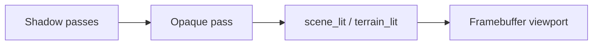

# Materiais Phong (3D)

> **Namespace:** `Caffeine::Render`, `Caffeine::ECS`  
> **Shaders:** `src/render/shaders/scene_lit.{vert,frag}`, `terrain_lit.frag`  
> **Renderer:** `GpuSceneRenderer`  
> **Status:** ✅ Implementado (meshes + terreno)

---

## Visão geral

A Caffeine usa **Phong clássico** como modelo de iluminação imediato antes da evolução para PBR deferred:

```
final = ambient + Σ (diffuse + specular) × shadowAttenuation
```

- **Diffuse:** `max(dot(N, L), 0) × albedo × lightColor`
- **Specular:** `pow(max(dot(R, V), 0), shininess) × lightColor`
- **Normal mapping:** perturbação de `N` via TBN e textura normal (meshes) ou triplanar (terreno)

---

## Componentes ECS

### MeshFilterComponent

```cpp
struct MeshFilterComponent {
    MeshPrimitive primitive = MeshPrimitive::Cube;
    std::string   customMeshPath;
    std::string   customTexturePath;
    std::string   customNormalPath;   // caminho relativo ao projeto
    std::string   customMaterialPath;
    f32           shininess = 32.0f;  // expoente especular
};
```

**Inspector (Doppio):** Albedo Texture, Normal Map, Shininess (slider 1–128).

### TerrainComponent

```cpp
char normalMapPath[256] = {};
f32  shininess = 16.0f;
bool castShadows = true;
bool receiveShadows = true;
```

**Inspector:** Normal Map, Shininess, Albedo Texture (splat layers).

---

## Pipeline GPU



1. `renderDirectionalShadows()` — até 2 luzes direcionais com `castShadows`.
2. `renderPointShadows()` — até 2 luzes pontuais (cubemap depth).
3. Pass principal com UBO de luzes + UBO de sombras + materiais.

### Samplers (meshes — `scene_lit.frag`)

| Slot | Textura |
|------|---------|
| 0 | Albedo |
| 1 | Normal map |
| 2–3 | Shadow maps direcionais |
| 4–5 | Cubemaps sombra pontual |

### Samplers (terreno — `terrain_lit.frag`)

| Slot | Textura |
|------|---------|
| 0–4 | Splat + camadas |
| 5 | Normal map triplanar |
| 6–7 | Shadow maps direcionais |
| 8–9 | Cubemaps sombra pontual |

---

## Tangentes

`MeshLoader::computeMeshTangents()` calcula tangentes por vértice (MikkTSpace simplificado) após import OBJ/glTF. O vertex shader constrói a matriz TBN:

```
TBN = mat3(normalize(T), normalize(B), normalize(N))
N'  = normalize(TBN * (sample(normalMap) * 2 - 1)))
```

---

## Caminho CPU (legado)

No editor, quando o viewport 3D **não** usa GPU texturizado (`gpuTextured3D == false`), o raster CPU ainda pode avaliar iluminação difusa com shadow maps CPU. O caminho shaded default com GPU activo **não** constrói CPU shadows.

Ver [`shadow-mapping.md`](shadow-mapping.md) e [`plans/2026-09-21-rendering-roadmap.md`](../plans/2026-09-21-rendering-roadmap.md) P0.

---

## Referências

- [`assets/mesh-loading.md`](../assets/mesh-loading.md) — tangentes e import
- [`terrain/terrain-system.md`](../terrain/terrain-system.md) — normal map no terreno
- [`shadow-mapping.md`](shadow-mapping.md) — passes de sombra GPU
