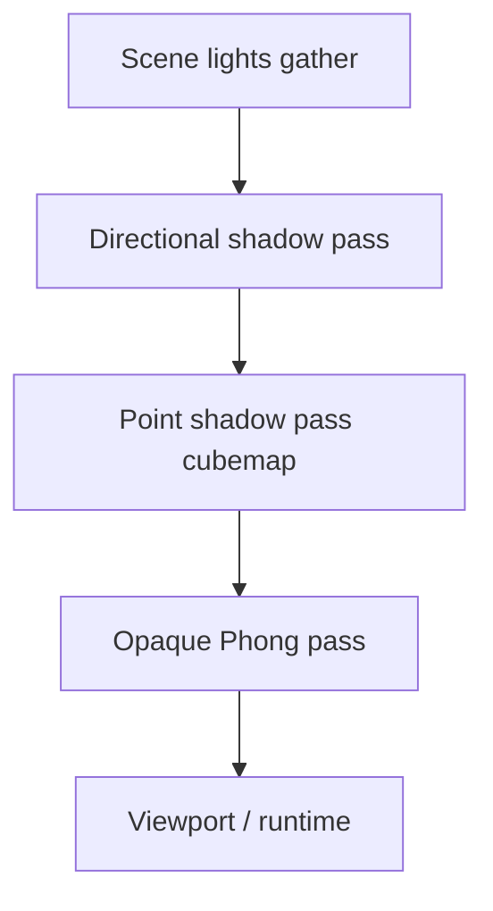

# Shadow Mapping (GPU)

> **Namespace:** `Caffeine::Render`  
> **Ficheiros:** `GpuDirectionalShadowMap.*`, `GpuPointShadowMap.*`, `GpuSceneRenderer.cpp`  
> **Shaders:** `shadow_depth.*`, `scene_lit.frag`, `terrain_lit.frag`  
> **Status:** ✅ Direcional CSM (4 cascatas, luz 0) + point + spot (até 2 cada)

---

## Visão geral

Sombras dinâmicas são renderizadas em passes separados antes do pass opaco principal. O fragment shader faz PCF 3×3 sobre mapas de profundidade.



---

## Luzes suportadas

| Tipo | Pass | Limite | Shader sample |
|------|------|--------|---------------|
| Direcional | Atlas 1024² (4×512 cascatas na luz 0) | 2 | `sampleDirShadowCSM()` PCF 3×3 |
| Pontual | Cubemap depth | 2 | `samplePointShadow()` |
| Spot | Perspective depth 2D | 2 | `sampleSpotShadow()` |

Apenas luzes com `castShadows == true` entram nos passes GPU.

---

## SceneShadowUBO (std140)

Espelhado em C++ (`GpuSceneRenderer.cpp`) e GLSL:

```glsl
// Direcional: mat4 view-projection × 2 + flags
// Point: vec3 position × 2, float radius × 2, float valid × 2
```

`uDirShadowValid` / `uPointShadowValid` permitem ao shader ignorar slots não atribuídos.

---

## GpuPointShadowMap

- `setSlot(index, position, radius)` após render do cubemap.
- `clearSlot(index)` quando a luz deixa de projectar sombra.
- Cubemap ligado nos slots 4–5 (meshes) ou 8–9 (terreno).

---

## Editor vs runtime

| Contexto | Shadow **passes** | Shadow **samplers** ligados |
|----------|-------------------|----------------------------|
| Editor Scene Viewport | ❌ `enableShadows=false` | ✅ sempre (`bindShadowTextures`) |
| Editor previews | ❌ | ✅ |
| Runtime (`RuntimeSceneRenderer`) | ✅ quando `enableShadows=true` | ✅ |

### ⚠️ Regra de segurança (SIGSEGV NVIDIA)

`enableShadows=false` **omite** `renderDirectionalShadows` / point / spot — não omite `bindShadowTextures()`.

Os fragment shaders declaram samplers de sombra mesmo quando `uDirShadowValid=0`. Slots não ligados podem causar **segmentation fault** no driver NVIDIA.

```cpp
// GpuSceneRenderer::renderMeshes — padrão correcto
if (options.enableShadows) {
    renderDirectionalShadows(...);
}
bindShadowTextures(2, 4, 6);  // obrigatório no início do pass opaco
```

Com GPU activo no editor, `gatherSceneLighting` com CPU shadow maps **não** corre para meshes (`gpuOwnsSceneMeshes`).

---

## CSM (cascaded shadow maps)

- **Luz direcional slot 0:** 4 cascatas em atlas 1024² (quadrantes 512²).
- Splits práticos (λ=0.5) entre `nearClip` e `shadowDistance`.
- `SceneShadowUBO`: `uDirShadowVP[8]`, `uDirCascadeSplits[2]`, `uCameraView`.
- **Luz slot 1:** mapa único (sem cascatas).

## Spot shadows GPU

- `GpuSpotShadowMap` — até 2 luzes, 512², VP de `buildSpotLightVP()` (mesma matemática que CPU).
- Iluminação spot no `scene_lit.frag` / `terrain_lit.frag` com cone + shadow map.

## Próximos passos (roadmap P4)

1. **PCSS** — soft shadows em cascatas.
2. **CSM na luz secundária** — slot 1 com cascatas.
3. **Inter-cascade blending** — reduzir seams entre cascatas.

---

## Referências

- [`materials-phong.md`](materials-phong.md)
- [`plans/2026-09-21-rendering-roadmap.md`](../plans/2026-09-21-rendering-roadmap.md) — fase P4
- [`plans/2026-09-22-phong-gpu-handles-session.md`](../plans/2026-09-22-phong-gpu-handles-session.md)
